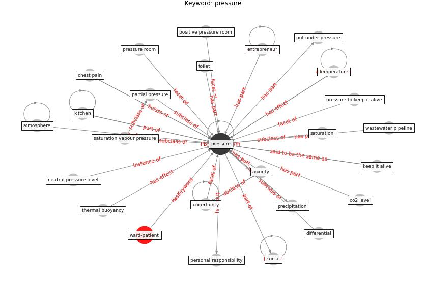

# Keyword: pressure

* [ward-patient](cluster_Cluster_15)

## Keywords

 * Cluster_15, [anxiety](keyword_anxiety), atmosphere, chest pain, co2 level, differential, [entrepreneur](keyword_entrepreneur), keep it alive, kitchen, neutral pressure level, partial pressure, personal responsibility, positive pressure room, precipitation, [pressure](keyword_pressure), pressure room, pressure to keep it alive, put under pressure, saturation, saturation vapour pressure, [social](keyword_social), [temperature](keyword_temperature), thermal buoyancy, [toilet](keyword_toilet), uncertainty, wastewater pipeline

## Concepts

 

## Neighbours

### Closest articles

* Review and comparison of HVAC operation guidelines in different countries during the COVID-19 pandemic - [LINK](article_guo_review_2021)
* Mechanistic insights into the effect of humidity on airborne influenza virus survival, transmission and incidence - [LINK](article_marr_mechanistic_2019)
* Effects of temperature and humidity on the spread of COVID-19: A systematic review - [LINK](article_mecenas_effects_2020)
* How COVID-19 Could Accelerate the Adoption of New Retail Technologies and Enhance the (E-)Servicescape - [LINK](article_willems_how_2021)
* Applications of ultraviolet germicidal irradiation disinfection in health care facilities: Effective adjunct, but not stand-alone technology - [LINK](article_memarzadeh_applications_2010)
* Preparing critical infrastructure for the future: Lessons learnt from the Covid-19 pandemic - [LINK](article_tomalska_preparing_2022)
* COVID-19 Forced Hospitals to Build Negative Pressure Rooms Fast - [LINK](article_dyer_covid-19_2020)
* A critical review of heating, ventilation, and air conditioning (HVAC) systems within the context of a global SARS-CoV-2 epidemic - [LINK](article_elsaid_critical_2021)
* An Overview of Biomedical Ontologies for Pandemics and Infectious Diseases Representation - [LINK](article_bayoudhi_overview_2021)
* Designing for COVID-2x: Reflecting on Future-Proofing Human Habitation for the Inevitable Next Pandemic - [LINK](article_spennemann_designing_2022)

### Closest BPs

