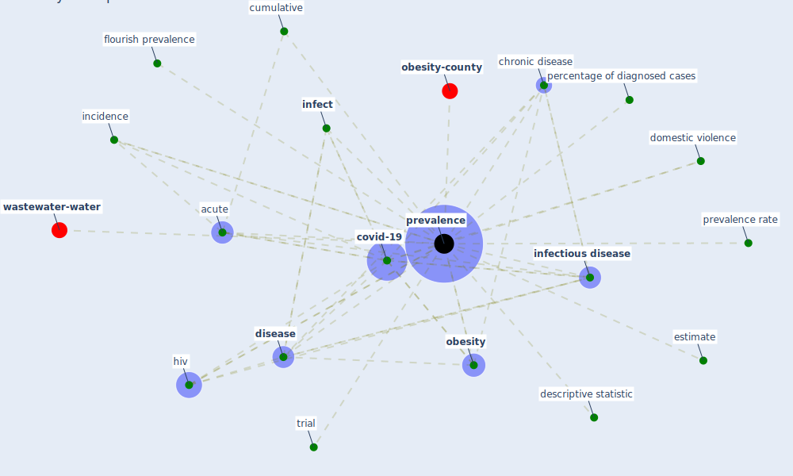

# Keyword: prevalence

* [wastewater-water](cluster_0)

* [obesity-county](cluster_9)

## Keywords

 * Cluster_0, Cluster_9, acute, [chronic disease](keyword_chronic_disease), [covid-19](keyword_covid-19), cumulative, descriptive statistic, [disease](keyword_disease), domestic violence, estimate, flourish prevalence, [hiv](keyword_hiv), incidence, [infect](keyword_infect), [infectious disease](keyword_infectious_disease), [obesity](keyword_obesity), percentage of diagnosed cases, [prevalence](keyword_prevalence), prevalence rate, trial

## Mapping

## Neighbours

### Closest articles

* Multilevel Analysis of Personal, Non-Medical COVID-19-Related Impact Worldwide - [LINK](article_dye_multilevel_2020)
* First confirmed detection of SARS-CoV-2 in untreated wastewater in Australia: A proof of concept for the wastewater surveillance of COVID-19 in the community - [LINK](article_ahmed_first_2020)
* Treating two pandemics for the price of one: Chronic and infectious disease impacts of the built and natural environment - [LINK](article_frank_treating_2021)
* SARS-CoV-2 RNA in wastewater anticipated COVID-19 occurrence in a low prevalence area - [LINK](article_randazzo_sars-cov-2_2020)
* Mental health economics: A prospective study on psychological flourishing and associations with healthcare costs and sickness benefit transfers in Denmark - [LINK](article_santini_mental_2021)
* Association between indoor-outdoor green features and psychological health during the COVID-19 lockdown in Italy: A cross-sectional nationwide study - [LINK](article_spano_association_2021)
* Detection of SARS-CoV-2 in raw and treated wastewater in Germany – Suitability for COVID-19 surveillance and potential transmission risks - [LINK](article_westhaus_detection_2021)
* COVID-19 and the rise of intimate partner violence - [LINK](article_aguero_covid-19_2021)
* Addressing vulnerability, building resilience: community-based adaptation to vector-borne diseases in the context of global change - [LINK](article_bardosh_addressing_2017)

### Closest BPs

