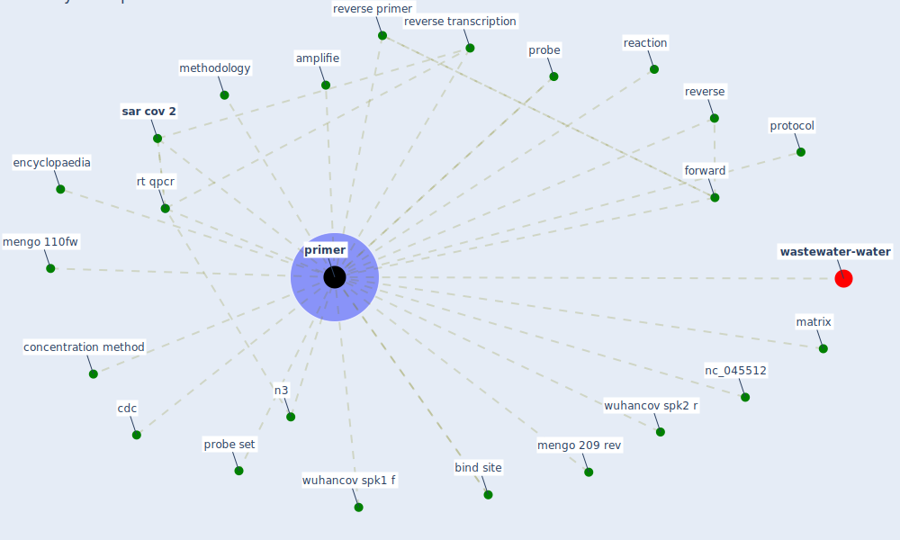

# Keyword: primer

* [wastewater-water](cluster_0)

## Keywords

 * Cluster_0, amplifie, bind site, [cdc](keyword_cdc), concentration method, encyclopaedia, forward, matrix, mengo 110fw, mengo 209 rev, methodology, n3, nc_045512, [primer](keyword_primer), primers, probe, probe set, [protocol](keyword_protocol), reaction, reverse, reverse primer, reverse transcription, rt qpcr, [sar cov 2](keyword_sar_cov_2), wuhancov spk1 f, wuhancov spk2 r

## Mapping

## Neighbours

### Closest articles

* Detection of SARS-CoV-2 in raw and treated wastewater in Germany – Suitability for COVID-19 surveillance and potential transmission risks - [LINK](article_westhaus_detection_2021)
* First detection of SARS-CoV-2 in untreated wastewaters in Italy - [LINK](article_la_rosa_first_2020)
* First confirmed detection of SARS-CoV-2 in untreated wastewater in Australia: A proof of concept for the wastewater surveillance of COVID-19 in the community - [LINK](article_ahmed_first_2020)
* SARS-CoV-2 Titers in Wastewater Are Higher than Expected from Clinically Confirmed Cases - [LINK](article_wu_sars-cov-2_2020)
* Wastewater-Based Epidemiology to monitor COVID-19 outbreak: Present and future diagnostic methods to be in your radar - [LINK](article_barcelo_wastewater-based_2020)
* SARS-CoV-2 RNA in wastewater anticipated COVID-19 occurrence in a low prevalence area - [LINK](article_randazzo_sars-cov-2_2020)
* Presence of SARS-Coronavirus-2 RNA in Sewage and Correlation with Reported COVID-19 Prevalence in the Early Stage of the Epidemic in The Netherlands - [LINK](article_medema_presence_2020)

### Closest BPs

