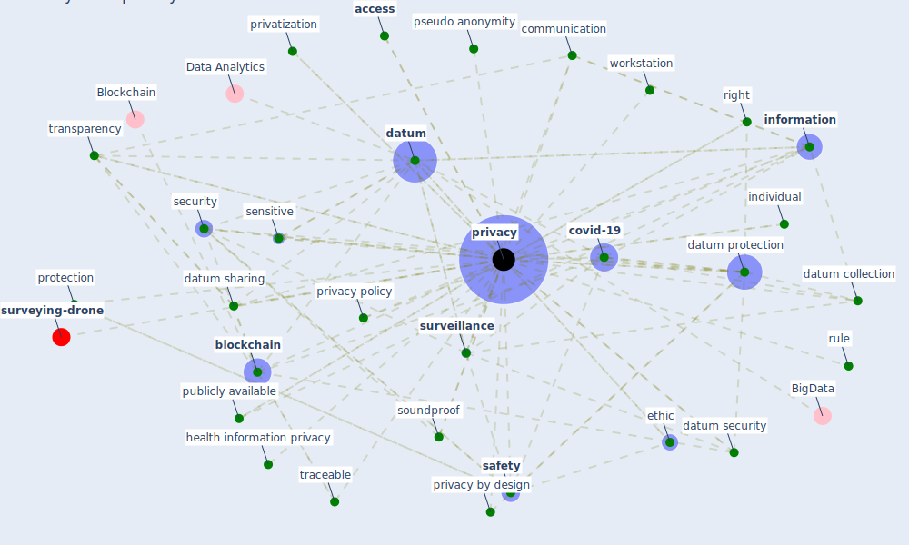

# Keyword: privacy

* [surveying-drone](cluster_13)

## Keywords

 * abuse the privacy, abuse the privacy of people, [access](keyword_access), access control, adaptive furnishing, [architecture](keyword_architecture), average, [balcony](keyword_balcony), behavior, big healthcare datum, [blockchain](keyword_blockchain), blockchain encryption, [blockchain technology](keyword_blockchain_technology), [bluetooth](keyword_bluetooth), citizen, civil liberty, civil right, comfort, comfort and safety, communication, concealment of datum, concern, confidentiality of communication, confidentiality of correspondence42, consumer protection, contact trace, [covid-19](keyword_covid-19), cybersecurity, [datum](keyword_datum), datum collection, datum gap, datum identify individual, datum privacy, [datum protection](keyword_datum_protection), datum security, datum security and privacy, [datum sharing](keyword_datum_sharing), datum usage, [digitalisation](keyword_digitalisation), dutch data protection authority, edge computing, encryption, enforcement of power relation, ethic, existential, [facebook](keyword_facebook), health datum, health information, health information privacy, health insurance, health insurance privacy, helsinki 2 declaration on ethic, individual, [information](keyword_information), information be receive, information security, informed consent, intrude, intrude on citizen s privacy, intrusion, non personally identifiable, [policy](keyword_policy), policy requirement, power relation, [privacy](keyword_privacy), privacy by design, [privacy policy](keyword_privacy_policy), privacy within the home, private datum, privatization, protection, protection of the say data, [protocol](keyword_protocol), pseudo anonymity, pseudonym, [public place](keyword_public_place), publicly available, record, right, right to privacy, rule, [safety](keyword_safety), [security](keyword_security), security of datum, security risk, self report, sensitive, software, software define privacy, soundproof, [space](keyword_space), [surveillance](keyword_surveillance), traceable, transformation, transparency, user datum, user i d, user privacy, workspace satisfaction, [workstation](keyword_workstation)

## Mapping

## Neighbours

### Closest articles

* 2020 Data Protection Report - [LINK](article_council_of_europe_2020_2020)
* The Emergence of Anti-Privacy and Control at the Nexus between the Concepts of Safe City and Smart City - [LINK](article_allam_emergence_2019)
* Blockchain technology and its applications to combat COVID-19 pandemic - [LINK](article_sharma_blockchain_2022)
* The role of 5G for digital healthcare against COVID-19 pandemic: Opportunities and challenges - [LINK](article_siriwardhana_role_2021)
* Impact of COVID-19 on IoT Adoption in Healthcare, Smart Homes, Smart Buildings, Smart Cities, Transportation and Industrial IoT - [LINK](article_umair_impact_2021)
* Mobile Technology Solution for COVID-19: Surveillance and Prevention - [LINK](article_raza_mobile_2021)
* A Comprehensive Review of the COVID-19 Pandemic and the Role of IoT, Drones, AI, Blockchain, and 5G in Managing its Impact - [LINK](article_chamola_comprehensive_2020)
* Pandemic Analytics: How Countries are Leveraging Big Data Analytics and Artificial Intelligence to Fight COVID-19? - [LINK](article_mehta_pandemic_2021)
* Contributions of Smart City Solutions and Technologies to Resilience against the COVID-19 Pandemic: A Literature Review - [LINK](article_sharifi_contributions_2021)
* Questioning the use of the balcony in apartments during the COVID-19 pandemic process - [LINK](article_aydin_questioning_2020)

### Closest BPs

