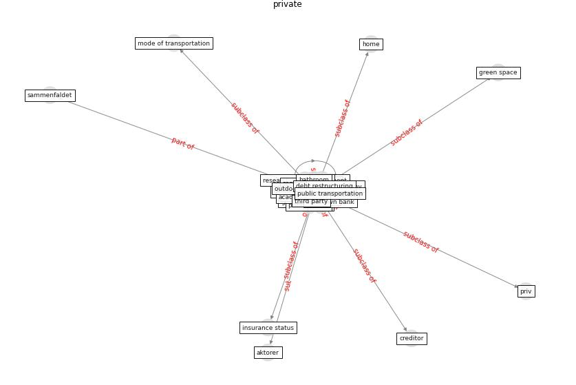

# Keyword: __private__
## Clusters

* Cluster 4: [smart-city](cluster_4)

## Concepts

 

## Top 10 articles for __private__
* realdania_refleksioner_2022_EN ([realdania_refleksioner_2022_EN](article_realdania_refleksioner_2022_EN))
* world_bank_world_2022 ([world_bank_world_2022](article_world_bank_world_2022))
* The Impact of COVID-19 on Public Space: A
Review of the Emerging Questions ([honey-roses_impact_2020](article_honey-roses_impact_2020))
* Indirect effects of COVID-19 on the environment ([zambrano-monserrate_indirect_2020](article_zambrano-monserrate_indirect_2020))
* Questioning the use of the balcony in apartments during
the COVID-19 pandemic process ([aydin_questioning_2020](article_aydin_questioning_2020))
* rtpi_urban_2021 ([rtpi_urban_2021](article_rtpi_urban_2021))
* ostherr_telehealth_2020 ([ostherr_telehealth_2020](article_ostherr_telehealth_2020))
* COVID-19 and Living space challenge. Well-being and
Public Health recommendations for a healthy, safe, and
sustainable housing. ([dalessandro_covid-19_2020](article_dalessandro_covid-19_2020))
* How COVID-19 Redefines the Concept of
Sustainability ([hakovirta_how_2020](article_hakovirta_how_2020))
* Assessment method for new sustainability indicators
providing pandemic resilience for residential buildings ([tokazhanov_assessment_2021](article_tokazhanov_assessment_2021))
