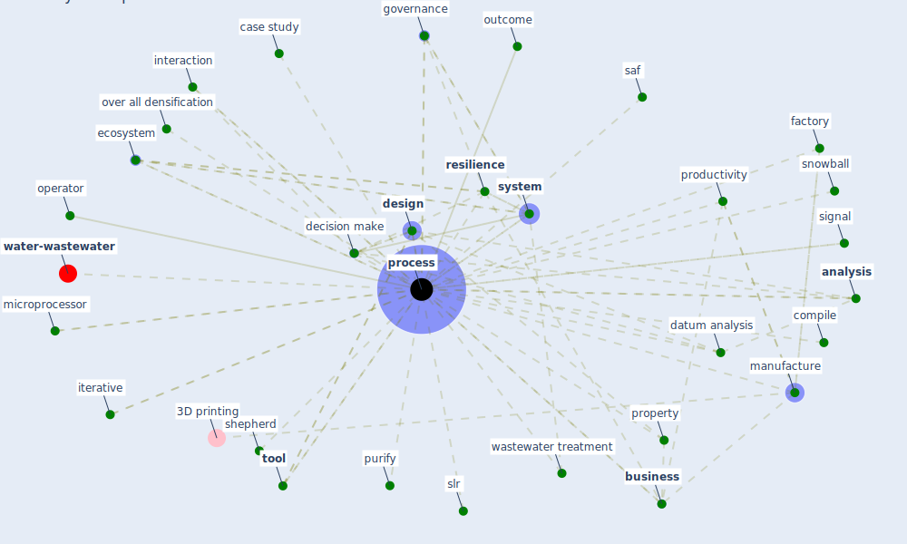

# Keyword: process

* [water-wastewater](cluster_7)

## Keywords

 * Cluster_7, [analysis](keyword_analysis), bankruptcy, [business](keyword_business), case study, co creation, competency, compile, [compliance](keyword_compliance), crisis management, datum analysis, decision make, [design](keyword_design), design experiment, design philosophy, detail, developmental, economic activity, [ecosystem](keyword_ecosystem), [evidence](keyword_evidence), [factory](keyword_factory), governance, [health care](keyword_health_care), [healthcare](keyword_healthcare), hierarchy, [hospital](keyword_hospital), [image](keyword_image), [infrastructure](keyword_infrastructure), [interaction](keyword_interaction), iterative, life cycle, literature search, [manufacture](keyword_manufacture), [measure](keyword_measure), microprocessor, [neighborhood](keyword_neighborhood), operator, [optimization problem](keyword_optimization_problem), outcome, over all densification, [pandemic](keyword_pandemic), [place](keyword_place), police, [process](keyword_process), processed, processes, product, [productivity](keyword_productivity), productivity process, program, [project](keyword_project), property, [protocol](keyword_protocol), purify, [resilience](keyword_resilience), resilience as a process, saf, [service](keyword_service), service provision, shepherd, signal, slr, smart building tech, snowball, strategy, strategy implementation, [system](keyword_system), task, temperature zone, [tool](keyword_tool), understand, [vaccine](keyword_vaccine), waste, wastewater treatment

## Mapping

## Neighbours

### Closest articles

* How COVID-19 Could Accelerate the Adoption of New Retail Technologies and Enhance the (E-)Servicescape - [LINK](article_willems_how_2021)
* Designing a Multi-Agent Occupant Simulation System to Support Facility Planning and Analysis for COVID-19 - [LINK](article_lee_designing_2021)
* Navigating Climate Change: Rethinking the Role of Buildings - [LINK](article_cole_navigating_2020)
* Addressing vulnerability, building resilience: community-based adaptation to vector-borne diseases in the context of global change - [LINK](article_bardosh_addressing_2017)
* Overcoming the Impact of COVID-19 Using Integrated Project Delivery Model - [LINK](article_g_overcoming_2020)
* Mapping research in logistics and supply chain management during COVID-19 pandemic - [LINK](article_montoya-torres_mapping_2021)
* Impact of COVID-19 on IoT Adoption in Healthcare, Smart Homes, Smart Buildings, Smart Cities, Transportation and Industrial IoT - [LINK](article_umair_impact_2021)
* Digital Twin of COVID-19 Mass Vaccination Centers - [LINK](article_pilati_digital_2021)
* Propositions for a Resilient, Post-COVID-19 Future for the AEC Industry - [LINK](article_nassereddine_propositions_2021)
* COVID-19 as a Harbinger of Transforming Infrastructure Resilience - [LINK](article_carvalhaes_covid-19_2020)

### Closest BPs

