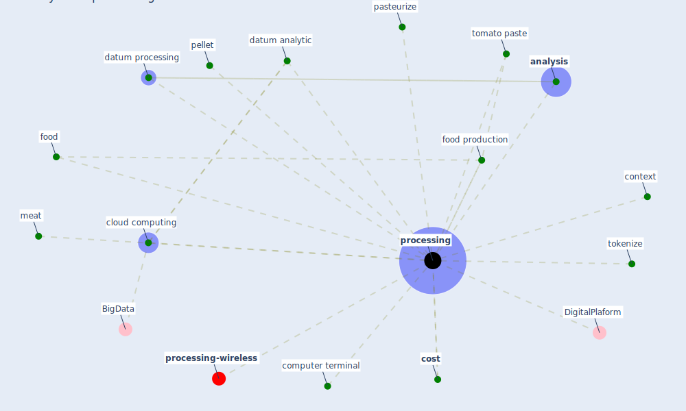

# Keyword: processing

* [processing-wireless](cluster_14)

## Keywords

 * Cluster_14, DigitalPlaform, [analysis](keyword_analysis), cloud computing, computer terminal, context, [cost](keyword_cost), datum analytic, datum processing, food, food production, meat, pasteurize, pellet, [processing](keyword_processing), tokenize, tomato paste

## Mapping

## Neighbours

### Closest articles

* Questioning the use of the balcony in apartments during the COVID-19 pandemic process - [LINK](article_aydin_questioning_2020)
* Graphene-based nanomaterials as antimicrobial surface coatings: A parallel approach to restrain the expansion of COVID-19 - [LINK](article_ayub_graphene-based_2021)
* 2020 Data Protection Report - [LINK](article_council_of_europe_2020_2020)
* A comprehensive review on indoor air quality monitoring systems for enhanced public health - [LINK](article_saini_comprehensive_2020)
* Health, Wellbeing \& Productivity in Offices - [LINK](article_world_green_building_council_health_2014)
* COVID-19 Experience Transforming the Protective Environment of Office Buildings and Spaces - [LINK](article_phapant_covid-19_2021)
* Social distancing enhanced automated optimal design of physical spaces in the wake of the COVID-19 pandemic - [LINK](article_ugail_social_2021)
* Exploring the Non-Medical impacts of Covid-19 using Natural Language Processing - [LINK](article_agade_exploring_2020)

### Closest BPs

