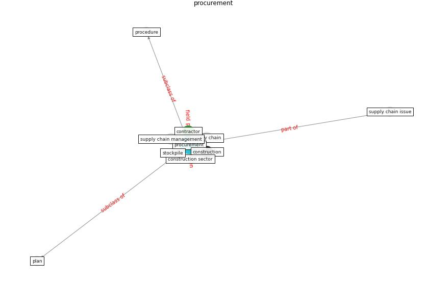

# Keyword: __procurement__
## Clusters

* Cluster 14: [surveying-drone](cluster_14.md)

## Concepts

 

## Articles
* Overcoming the Impact of COVID-19 Using Integrated
Project Delivery Model ([g_overcoming_2020](article_g_overcoming_2020.md))
* Borders and Catastrophe: lessons from COVID-19 for the
European Green Deal ([klein_borders_2021](article_klein_borders_2021.md))
* Identifying Actions to Control and Mitigate the
Effects of the COVID-19 Pandemic on Construction
Organizations: Preliminary Findings ([raoufi_identifying_2021](article_raoufi_identifying_2021.md))
* Influence between COVID-19 Impacts and Project
Stakeholders in Chilean Construction Projects ([araya_influence_2021](article_araya_influence_2021.md))
* Guidelines for Responding to COVID-19 Pandemic:
Best Practices, Impacts, and Future Research
Directions ([assaad_guidelines_2021](article_assaad_guidelines_2021.md))
* oecd_covid-19_2021-50 ([oecd_covid-19_2021-50](article_oecd_covid-19_2021-50.md))
* ogunnusi_covid-19_2020-0 ([ogunnusi_covid-19_2020-0](article_ogunnusi_covid-19_2020-0.md))
* realdania_refleksioner_2022_EN-1350 ([realdania_refleksioner_2022_EN-1350](article_realdania_refleksioner_2022_EN-1350.md))
* realdania_refleksioner_2022_EN-150 ([realdania_refleksioner_2022_EN-150](article_realdania_refleksioner_2022_EN-150.md))
* realdania_refleksioner_2022_EN-1450 ([realdania_refleksioner_2022_EN-1450](article_realdania_refleksioner_2022_EN-1450.md))
