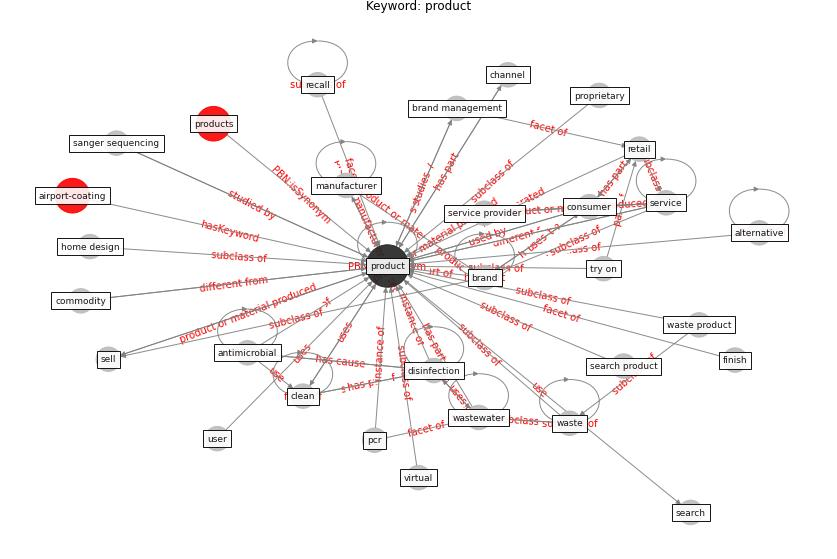

# Keyword: product

* [airport-coating](cluster_Cluster_6)

## Keywords

 * Cluster_6, alternative, [antimicrobial](keyword_antimicrobial), book, brand, brand management, channel, [circle](keyword_circle), [clean](keyword_clean), commodity, [consumer](keyword_consumer), cost, [covid-19](keyword_covid-19), [customer](keyword_customer), [disinfection](keyword_disinfection), export, finance, finish, home design, hs6, insert, insurance, judgment, [manufacture](keyword_manufacture), manufacturer, [marketing](keyword_marketing), meat, [pcr](keyword_pcr), pharmaceutical, pricing, pricing information, process, [product](keyword_product), production, products, proprietary, recall, [retail](keyword_retail), sanger sequencing, search, search product, sell, service, service provider, [store](keyword_store), system design, try on, unmet need, [user](keyword_user), virtual, [waste](keyword_waste), waste product, [wastewater](keyword_wastewater)

## Concepts

 

## Neighbours

### Closest articles

* How COVID-19 Could Accelerate the Adoption of New Retail Technologies and Enhance the (E-)Servicescape - [LINK](article_willems_how_2021)
* Overcoming the Impact of COVID-19 Using Integrated Project Delivery Model - [LINK](article_g_overcoming_2020)
* World Bank Development Report - [LINK](article_world_bank_world_2022)
* A critical analysis of the impacts of COVID-19 on the global economy and ecosystems and opportunities for circular economy strategies - [LINK](article_ibn-mohammed_critical_2021)
* Retail Signage During the COVID-19 Pandemic - [LINK](article_mcneish_retail_2020)
* Detection of SARS-CoV-2 in raw and treated wastewater in Germany – Suitability for COVID-19 surveillance and potential transmission risks - [LINK](article_westhaus_detection_2021)
* A Global Survey of Infection Control and Mitigation Measures for Combating the Transmission of COVID-19 Pandemic in Buildings Under Facilities Management Services - [LINK](article_sarvari_global_2022)
* Ventilation use in nonmedical settings during COVID-19: Cleaning protocol, maintenance, and recommendations - [LINK](article_nembhard_ventilation_2020)
* Prophylactic Architecture: Formulating the Concept of Pandemic-Resilient Homes - [LINK](article_elrayies_prophylactic_2022)
* COVID-19 Could Leverage a Sustainable Built Environment - [LINK](article_pinheiro_covid-19_2020)

### Closest BPs

