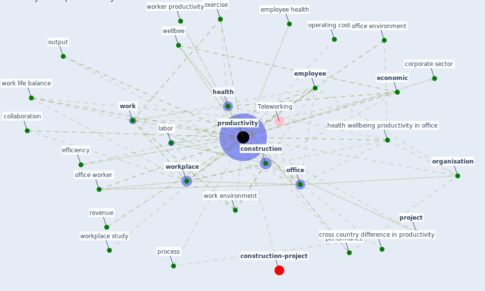

# Keyword: productivity

* [construction-project](cluster_8)

## Keywords

 * 38 health wellbeing productivity, Cluster_8, Teleworking, absence, absenteeism, acoustic, acoustic absorption, agriculture, average, [business](keyword_business), [climate](keyword_climate), cognitive ability, collaboration, [company](keyword_company), [concentration](keyword_concentration), [construction](keyword_construction), corporate sector, [covid-19](keyword_covid-19), creativity, cross country, cross country difference in productivity, design information, [desk](keyword_desk), [economic](keyword_economic), economic benefit, economic calculation, [economy](keyword_economy), ef ficiency, [efficiency](keyword_efficiency), [employee](keyword_employee), employee health, [environmental](keyword_environmental), ergonomic, exercise, file processing, [health](keyword_health), health and safety protocol, health and wellbeing, health wellbeing productivity, health wellbeing productivity in office, improvement, killer, killer variable, labor, light level, [manufacture](keyword_manufacture), metric, occupant pro ductivity, occupant satisfaction, [office](keyword_office), office environment, office worker, operating cost, [organisation](keyword_organisation), output, overhead cost, performance, performance management, [plant](keyword_plant), presenteeism, process, [productivity](keyword_productivity), productivity do not suffer, [project](keyword_project), project stop and delay, reinvent construction, [remote work](keyword_remote_work), remote work productivity, [research](keyword_research), revenue, school performance, sezs, sick leave, significantly, [sme](keyword_sme), [stress](keyword_stress), task planning, [teleworke](keyword_teleworke), [temperature](keyword_temperature), track metric, type speed, [wellbee](keyword_wellbee), [work](keyword_work), work environment, work from home, work hour, work life balance, work long, work ow, work stoppage, [worker](keyword_worker), worker productivity, [workforce](keyword_workforce), [workplace](keyword_workplace), workplace productivity, workplace study, zombie firm

## Mapping

## Neighbours

### Closest articles

* Health, Wellbeing \& Productivity in Offices - [LINK](article_world_green_building_council_health_2014)
* It’s time to reimagine where and how work will get done (PwC’s US Remote Work Survey) - [LINK](article_pricewaterhousecoopers_its_2021)
* World Bank Development Report - [LINK](article_world_bank_world_2022)
* The effect of a redesigned floor plan, occupant density and the quality of indoor climate on the cost of space, productivity and sick leave in an office building–A case study - [LINK](article_saari_effect_2006)
* Mechanisms for addressing the impact of COVID-19 on infrastructure projects - [LINK](article_king_mechanisms_2021)
* Occupant health in buildings: Impact of the COVID-19 pandemic on the opinions of building professionals and implications on research - [LINK](article_awada_occupant_2022)
* Ten questions concerning occupant health in buildings during normal operations and extreme events including the COVID-19 pandemic - [LINK](article_awada_ten_2021)
* Covid-19 Associated Risks and Mitigation Strategies relevant for the UK Construction Industry - [LINK](article_dan-jumbo_covid-19_2021)
* COVID-19 Experience Transforming the Protective Environment of Office Buildings and Spaces - [LINK](article_phapant_covid-19_2021)
* Impacts of COVID-19 on Health and Safety of Workforce in Construction Industry - [LINK](article_pamidimukkala_impacts_2021)

### Closest BPs

