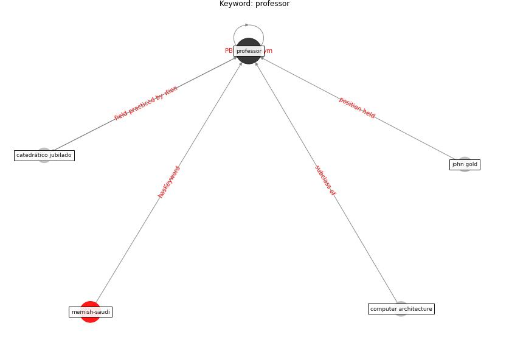

# Keyword: professor

* [memish-saudi](cluster_Cluster_8)

## Keywords

 * Cluster_8, catedrático jubilado, computer architecture, john gold, [professor](keyword_professor)

## Concepts

 

## Neighbours

### Closest articles

* Epidemics, Planning and the City: A Special Issue of Planning Perspectives - [LINK](article_davis_epidemics_2022)
* From Viral City to Smart City: Learning from Pandemic Experiences - [LINK](article_sakellarides_viral_2020)
* COVID19-Routes: A Safe Pedestrian Navigation Service - [LINK](article_cantarero_covid19-routes_2021)

### Closest BPs

