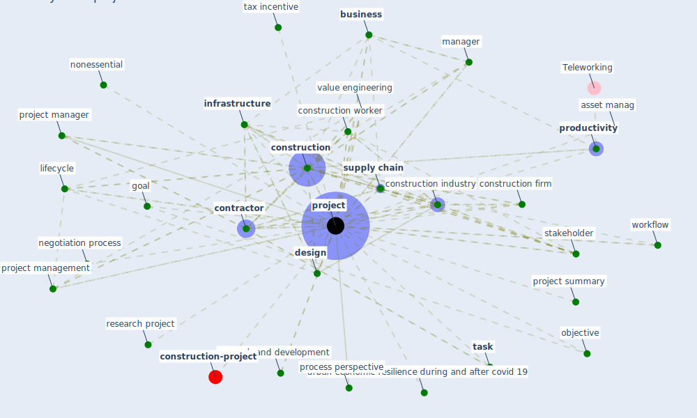

# Keyword: project

* [construction-pandemic](cluster_1)

## Keywords

 * 53 usbgc, Cluster_1, asset manag, bbmap, bmap, budget, [business](keyword_business), business as usual, communication line, communication network, [construction](keyword_construction), construction business, construction firm, [construction industry](keyword_construction_industry), construction operation, [construction worker](keyword_construction_worker), [contractor](keyword_contractor), coronavirus pandemic, cost, cost of such disruption, [covid-19](keyword_covid-19), covidgraph, cran, [design](keyword_design), design professional, economic resilience, estimator, fund, funded by, goal, governance, governance model, guideline, guideline project, [infrastructure](keyword_infrastructure), [iot](keyword_iot), learn, lifecycle, [manager](keyword_manager), negotiation process, nonessential, objective, panama canal, [process](keyword_process), process perspective, [productivity](keyword_productivity), [project](keyword_project), project base learn, project complexity, project document, project library, project lifecycle, [project management](keyword_project_management), project manager, project s, project stakeholder, project summary, projects, proof of concept, [research](keyword_research), research and development, research grant scheme, research project, sbply, sbply 17 180501 000334, [smart city](keyword_smart_city), [stakeholder](keyword_stakeholder), [supply chain](keyword_supply_chain), task, tax incentive, team, urban economic resilience during and after covid 19, usbgc, [value engineering](keyword_value_engineering), wastewater treatment, workflow, flexibility

## Mapping

## Neighbours

### Closest articles

* Overcoming the Impact of COVID-19 Using Integrated Project Delivery Model - [LINK](article_g_overcoming_2020)
* Influence between COVID-19 Impacts and Project Stakeholders in Chilean Construction Projects - [LINK](article_araya_influence_2021)
* The Effects of Pandemic on Construction Industry in the UK - [LINK](article_shibani_effects_2020)
* Impacts of COVID-19 on Health and Safety of Workforce in Construction Industry - [LINK](article_pamidimukkala_impacts_2021)
* Guidelines for Responding to COVID-19 Pandemic: Best Practices, Impacts, and Future Research Directions - [LINK](article_assaad_guidelines_2021)
* COVID-19 pandemic: the effects and prospects in the construction industry. - [LINK](article_ogunnusi_covid-19_2020)
* Urban planning after COVID-19 - [LINK](article_rtpi_urban_2021)
* Mechanisms for addressing the impact of COVID-19 on infrastructure projects - [LINK](article_king_mechanisms_2021)
* How COVID-19 Could Accelerate the Adoption of New Retail Technologies and Enhance the (E-)Servicescape - [LINK](article_willems_how_2021)
* Impact of COVID-19 on IoT Adoption in Healthcare, Smart Homes, Smart Buildings, Smart Cities, Transportation and Industrial IoT - [LINK](article_umair_impact_2021)

### Closest BPs

