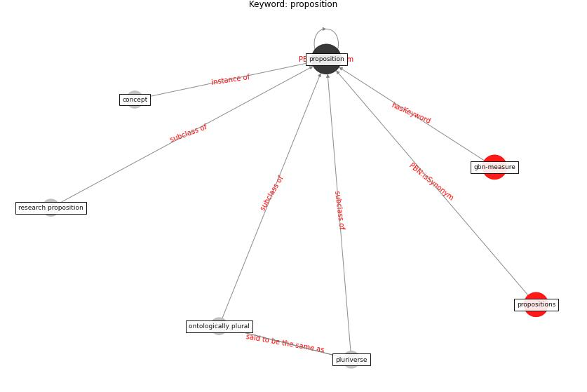

# Keyword: proposition

* [gbn-measure](cluster_Cluster_10)

## Keywords

 * Cluster_10, concept, ontologically plural, pluriverse, [proposition](keyword_proposition), propositions, research proposition

## Concepts

 

## Neighbours

### Closest articles

* The three modes of existence of the pandemic smart city - [LINK](article_soderstrom_three_2021)
* How COVID-19 Could Accelerate the Adoption of New Retail Technologies and Enhance the (E-)Servicescape - [LINK](article_willems_how_2021)
* <scp>COVID</scp>             ‐19: Small and medium enterprises challenges and responses with creativity, innovation, and entrepreneurship - [LINK](article_thukral_covid19_2021)

### Closest BPs

