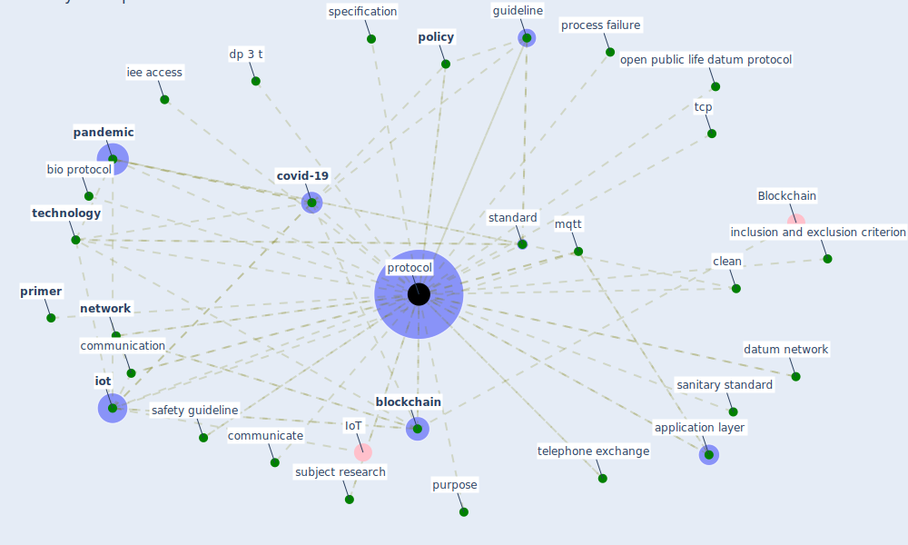

# Keyword: protocol

## Keywords

 * 3 land use policy, application layer, [architecture](keyword_architecture), bio protocol, [blockchain](keyword_blockchain), [bluetooth](keyword_bluetooth), [clean](keyword_clean), communicate, communication, contact trace, [coronavirus](keyword_coronavirus), covid 19 prevention, [covid-19](keyword_covid-19), datum network, [datum sharing](keyword_datum_sharing), delegate, [design](keyword_design), dp 3 t, experimental, framework, governance, guideline, health authority, health policy, human subject research, iee access, inclusion and exclusion criterion, [infection](keyword_infection), [internet of thing](keyword_internet_of_thing), [iot](keyword_iot), isimip, log processing, [management](keyword_management), measurement, [method](keyword_method), method and protocol, [mqtt](keyword_mqtt), [network](keyword_network), online survey, open public life datum protocol, [pandemic](keyword_pandemic), performance measurement, [platform](keyword_platform), [policy](keyword_policy), ppt, pre planning, preparedness, [primer](keyword_primer), primer and amplification, [privacy](keyword_privacy), privacy sensitive, process, process failure, [protocol](keyword_protocol), protocols, proximity network, [public health](keyword_public_health), public specification, publish subscribe, publish subscribe paradigm, purpose, robert proximitytracing, safety guideline, sanitary standard, specification, [standard](keyword_standard), standard for safety, standardization, [strategy](keyword_strategy), subject research, tcp, [technology](keyword_technology), telephone exchange, transparent, wireless communication, wireless sensor network, [zigbee](keyword_zigbee)

## Mapping

## Neighbours

### Closest articles

* Scalable IoT Architecture for Monitoring IEQ Conditions in Public and Private Buildings - [LINK](article_calvo_scalable_2022)
* Leveraging Digital Transformation Technologies to Tackle COVID-19: Proposing a Privacy-First Holistic Framework - [LINK](article_arpaci_leveraging_2021)
* COVID-19 Experience Transforming the Protective Environment of Office Buildings and Spaces - [LINK](article_phapant_covid-19_2021)
* Future (post-COVID) digital, smart and sustainable cities in the wake of 6G: Digital twins, immersive realities and new urban economies - [LINK](article_allam_future_2021)
* On the Coronavirus (COVID-19) Outbreak and the Smart City Network: Universal Data Sharing Standards Coupled with Artificial Intelligence (AI) to Benefit Urban Health Monitoring and Management - [LINK](article_allam_coronavirus_2020)
* Continuous IEQ monitoring system: Context and development - [LINK](article_parkinson_continuous_2019)
* Health Information Exchange with Blockchain amid Covid-19-like Pandemics - [LINK](article_christodoulou_health_2020)
* Pandemic stricken cities on lockdown. Where are our planning and design professionals [now, then and into the future]? - [LINK](article_allam_pandemic_2020)
* Health, Economic and Social Development Challenges of the COVID-19 Pandemic: Strategies for Multiple and Interconnected Issues - [LINK](article_panneer_health_2022)
* 2020 Data Protection Report - [LINK](article_council_of_europe_2020_2020)

### Closest BPs

