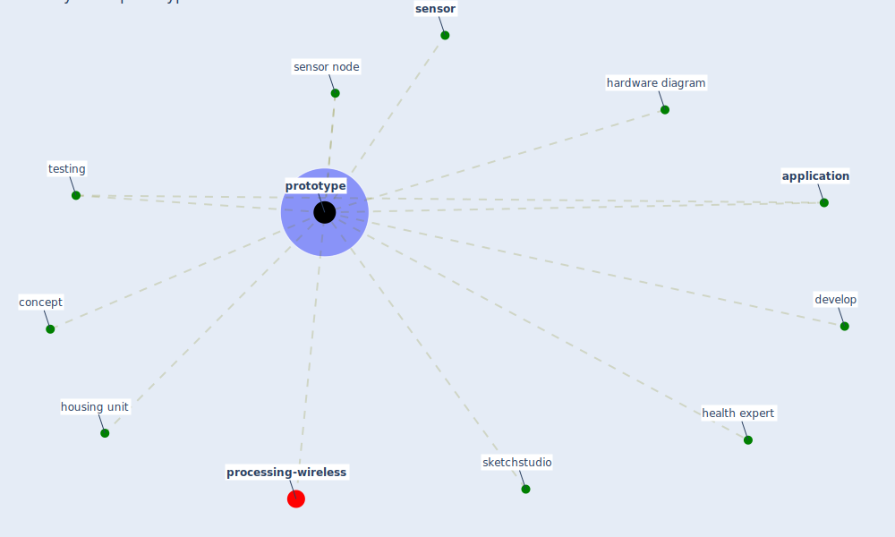

# Keyword: prototype

* [processing-wireless](cluster_14)

## Keywords

 * Cluster_14, [application](keyword_application), concept, develop, hardware diagram, health expert, housing unit, [prototype](keyword_prototype), prototypes, prototyping, [sensor](keyword_sensor), sensor node, sketchstudio, testing

## Mapping

## Neighbours

### Closest articles

* Scalable IoT Architecture for Monitoring IEQ Conditions in Public and Private Buildings - [LINK](article_calvo_scalable_2022)
* Designing a Multi-Agent Occupant Simulation System to Support Facility Planning and Analysis for COVID-19 - [LINK](article_lee_designing_2021)
* Leveraging Digital Transformation Technologies to Tackle COVID-19: Proposing a Privacy-First Holistic Framework - [LINK](article_arpaci_leveraging_2021)
* Propositions for a Resilient, Post-COVID-19 Future for the AEC Industry - [LINK](article_nassereddine_propositions_2021)
* Continuous IEQ monitoring system: Context and development - [LINK](article_parkinson_continuous_2019)

### Closest BPs

