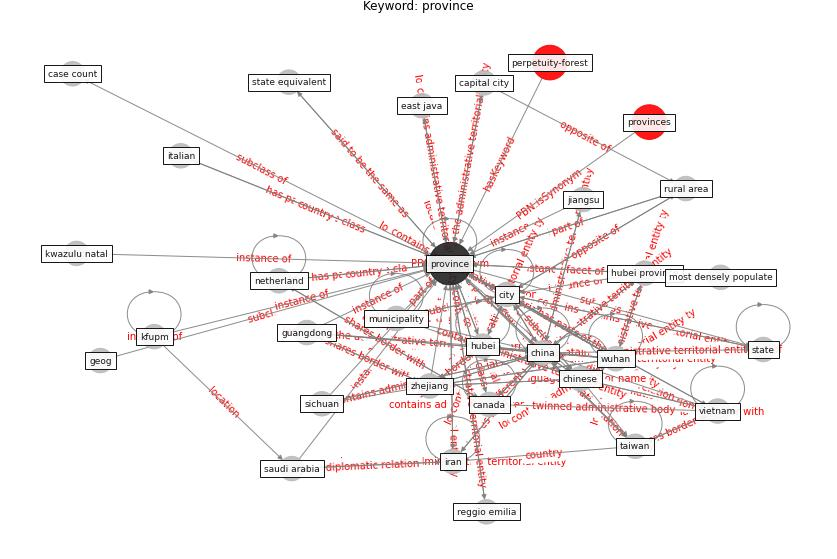

# Keyword: __province__
## Clusters

* Cluster 7: [liver-province](cluster_7)

## Concepts

 

## Top 10 articles for __province__
* The effect of human mobility and control measures on the
COVID-19 epidemic in China ([kraemer_effect_2020](article_kraemer_effect_2020))
* COVID-19 Higher Mortality in Chinese Regions
With Chronic Exposure to Lower Air Quality ([pansini_covid-19_2021](article_pansini_covid-19_2021))
* Association of built environment attributes with the
spread of COVID-19 at its initial stage in China ([li_association_2021](article_li_association_2021))
* The COVID-19 pandemic: Impacts on cities and major
lessons for urban planning, design, and management ([sharifi_covid-19_2020](article_sharifi_covid-19_2020))
* Open-source analytics tools for studying the COVID-19
coronavirus outbreak ([wu_open-source_2020](article_wu_open-source_2020))
* realdania_refleksioner_2022_EN ([realdania_refleksioner_2022_EN](article_realdania_refleksioner_2022_EN))
* Design COVID-19 Ontology: A Healthcare and
Safety Perspective ([aloulou_design_2022](article_aloulou_design_2022))
* How the 5G Enabled the COVID-19 Pandemic
Prevention and Control: Materiality, Affordance,
and (De-)Spatialization ([li_how_2022](article_li_how_2022))
* Housing Experience in Gated Communities in the
Time of Pandemics: Lessons Learned from
COVID-19 ([asfour_housing_2022](article_asfour_housing_2022))
* Respiratory pandemics, urban planning and design: A
multidisciplinary rapid review of the literature ([harris_respiratory_2022](article_harris_respiratory_2022))
