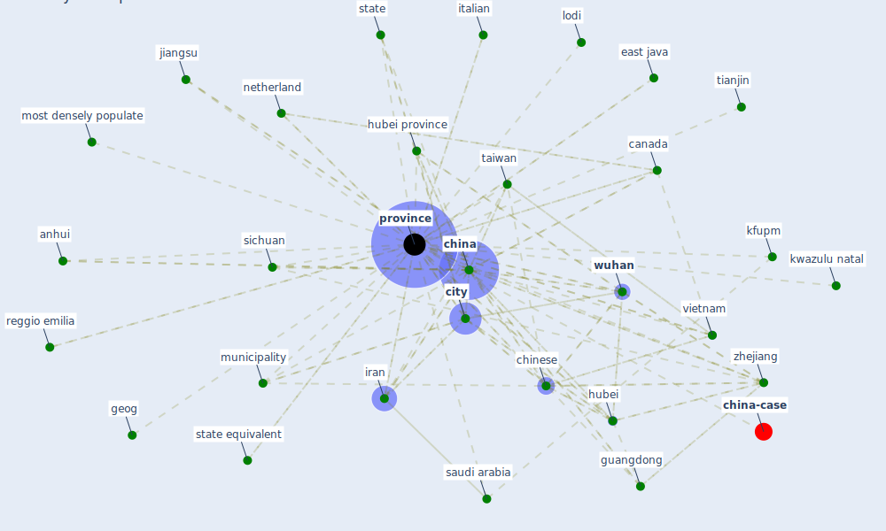

# Keyword: province

* [china-case](cluster_5)

## Keywords

 * Cluster_5, anhui, [beijing](keyword_beijing), bergamo, bergamo province, brianza, [canada](keyword_canada), case count, case count by province, [china](keyword_china), [chinese](keyword_chinese), [city](keyword_city), [country](keyword_country), country and province, cremona, east java, east jawa, geog, geographical, guangdong, hainan, henan, [hubei](keyword_hubei), hubei province, hunan, iran, italian, jiangsu, [kfupm](keyword_kfupm), kwazulu natal, lodi, map of the world, metropolitan city of milan, monza, most densely populate, municipality, national, [netherland](keyword_netherland), north brabant, north west, ontario, ontario government, [population](keyword_population), [province](keyword_province), provinces, reggio emilia, [saudi arabia](keyword_saudi_arabia), sichuan, [state](keyword_state), state equivalent, [taiwan](keyword_taiwan), tianjin, vietnam, west jawa, [wuhan](keyword_wuhan), zhejiang

## Mapping

## Neighbours

### Closest articles

* The effect of human mobility and control measures on the COVID-19 epidemic in China - [LINK](article_kraemer_effect_2020)
* COVID-19 Higher Mortality in Chinese Regions With Chronic Exposure to Lower Air Quality - [LINK](article_pansini_covid-19_2021)
* The COVID-19 pandemic: Impacts on cities and major lessons for urban planning, design, and management - [LINK](article_sharifi_covid-19_2020)
* Association of built environment attributes with the spread of COVID-19 at its initial stage in China - [LINK](article_li_association_2021)
* Open-source analytics tools for studying the COVID-19 coronavirus outbreak - [LINK](article_wu_open-source_2020)
* An investigation of transmission control measures during the first 50 days of the COVID-19 epidemic in China - [LINK](article_tian_investigation_2020)
* Design COVID-19 Ontology: A Healthcare and Safety Perspective - [LINK](article_aloulou_design_2022)
* How the 5G Enabled the COVID-19 Pandemic Prevention and Control: Materiality, Affordance, and (De-)Spatialization - [LINK](article_li_how_2022)
* Housing Experience in Gated Communities in the Time of Pandemics: Lessons Learned from COVID-19 - [LINK](article_asfour_housing_2022)
* Respiratory pandemics, urban planning and design: A multidisciplinary rapid review of the literature - [LINK](article_harris_respiratory_2022)

### Closest BPs

