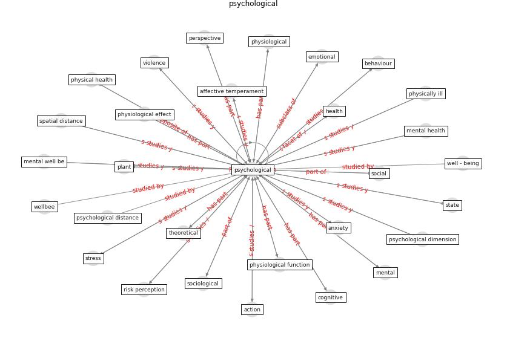

# Keyword: psychological

* [health-mental](cluster_Cluster_15)

## Keywords

 * Cluster_15, acoustic, action, aesthetic, affective, affective temperament, [anxiety](keyword_anxiety), aversion, aversion to big crowd, behavioral, behaviour, [behavioural](keyword_behavioural), benefit, benefit of nearby nature, [biodiversity](keyword_biodiversity), burnout, clinical, cognitive, cognitive affective, cognitive state, conceptualization, [coronavirus](keyword_coronavirus), covid 19 outbreak in china, [covid-19](keyword_covid-19), criminological, cross sectional, [depressive symptom](keyword_depressive_symptom), di tance, difficultie, [distance](keyword_distance), distance dimension, dysfunctional, emotional, [exposure](keyword_exposure), exposure to the outside, [fear](keyword_fear), [flourish](keyword_flourish), gender, green feature, happiness, [health](keyword_health), health and wellbeing, health outcome, health risk perception, home confinement, life satisfaction, [loneliness](keyword_loneliness), medicine, [mental](keyword_mental), mentalhealth, mere exposure, moodi ness, moodiness, moral, panic buying, perceive control, [perceive risk](keyword_perceive_risk), perception, [perspective](keyword_perspective), [physical](keyword_physical), physically ill, physiological, place attachment, positive perception, [protective behavior](keyword_protective_behavior), [psychological](keyword_psychological), [psychosocial](keyword_psychosocial), [qualitative](keyword_qualitative), quarantine, reinforcement behaviour, reservation, [resilience](keyword_resilience), restoration, [risk](keyword_risk), [risk perception](keyword_risk_perception), science, [social](keyword_social), sociological, [state](keyword_state), stigma, [stress](keyword_stress), stress alleviation, stress recovery theory, t bringslimark, the experience of nature, therapy, treatment, uncertainty, uncertainty of the future, view biophilia, [well be](keyword_well_be), [wellbee](keyword_wellbee), zhu g

## Concepts

 

## Neighbours

### Closest articles

* Association between indoor-outdoor green features and psychological health during the COVID-19 lockdown in Italy: A cross-sectional nationwide study - [LINK](article_spano_association_2021)
* Seeing the invisible hand: Underlying effects of COVID-19 on tourists’ behavioral patterns - [LINK](article_li_seeing_2020)
* Biophilic design in architecture and its contributions to health, well-being, and sustainability: A critical review - [LINK](article_zhong_biophilic_2022)
* How COVID-19 Could Accelerate the Adoption of New Retail Technologies and Enhance the (E-)Servicescape - [LINK](article_willems_how_2021)
* The psychological impact of COVID-19 on the mental health in the general population - [LINK](article_serafini_psychological_2020)
* Should I Stay or Should I Go? Tourists’ COVID-19 Risk Perception and Vacation Behavior Shift - [LINK](article_bratic_should_2021)
* Prophylactic Architecture: Formulating the Concept of Pandemic-Resilient Homes - [LINK](article_elrayies_prophylactic_2022)
* The impacts of knowledge, risk perception, emotion and information on citizens’ protective behaviors during the outbreak of COVID-19: a cross-sectional study in China - [LINK](article_ning_impacts_2020)
* Management of the COVID-19 pandemic: challenges, practices, and organizational support - [LINK](article_hossny_management_2022)
* Health, Wellbeing \& Productivity in Offices - [LINK](article_world_green_building_council_health_2014)

### Closest BPs

