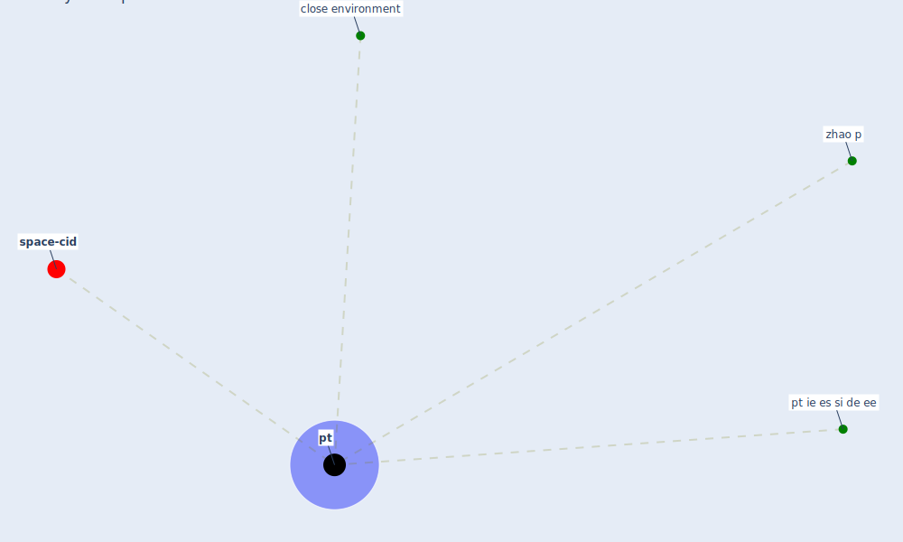

# Keyword: pt

* [space-cid](cluster_2)

## Keywords

 * Cluster_2, close environment, [pt](keyword_pt), pt ie es si de ee, zhao p

## Mapping

## Neighbours

### Closest articles

* Toilets dominate environmental detection of SARS-CoV-2 virus in a hospital - [LINK](article_ding_toilets_2020)
* Sustainable work throughout the life course: National policies and strategies, Publications Office of the European Union - [LINK](article_eurofund_sustainable_2016)
* Urban design attributes and resilience: COVID-19 evidence from New York City - [LINK](article_yang_urban_2021)

### Closest BPs

