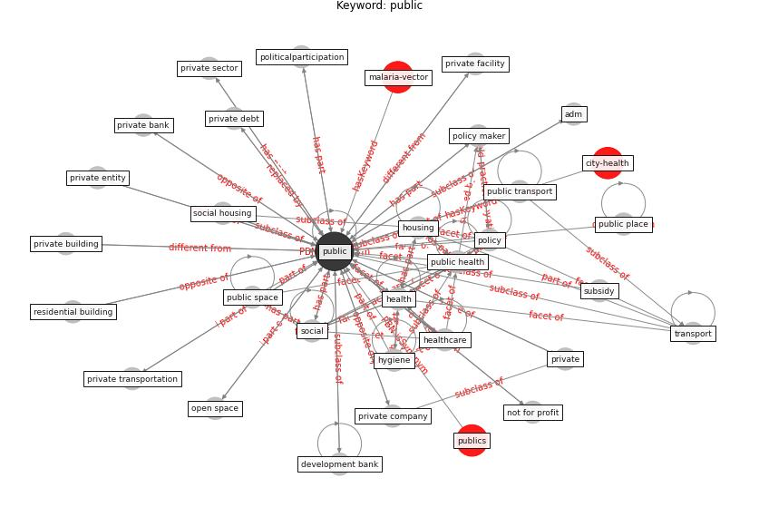

# Keyword: __public__
## Clusters

* Cluster 9: [health-building](cluster_9)
* Cluster 10: [city-smart](cluster_10)
* Cluster 12: [climate-change](cluster_12)

## Concepts

 

## Top 10 articles for __public__
* The Impact of COVID-19 on Public Space: A
Review of the Emerging Questions ([honey-roses_impact_2020](article_honey-roses_impact_2020))
* world_bank_world_2022 ([world_bank_world_2022](article_world_bank_world_2022))
* rtpi_urban_2021 ([rtpi_urban_2021](article_rtpi_urban_2021))
* Mitigation strategies and compliance in the COVID-19
fight; how much compliance is enough? ([mukerjee_mitigation_2021](article_mukerjee_mitigation_2021))
* realdania_refleksioner_2022_EN ([realdania_refleksioner_2022_EN](article_realdania_refleksioner_2022_EN))
* Scalable IoT Architecture for Monitoring IEQ
Conditions in Public and Private Buildings ([calvo_scalable_2022](article_calvo_scalable_2022))
* afrin_covid-19_2021 ([afrin_covid-19_2021](article_afrin_covid-19_2021))
* eurofund_sustainable_2016 ([eurofund_sustainable_2016](article_eurofund_sustainable_2016))
* 10 Adaptive Measures for Public Places to face the
COVID 19 Pandemic Outbreak ([cheshmehzangi_10_2020](article_cheshmehzangi_10_2020))
* The impacts of knowledge, risk perception, emotion and
information on citizens’ protective behaviors during the
outbreak of COVID-19: a cross-sectional study in
China ([ning_impacts_2020](article_ning_impacts_2020))
