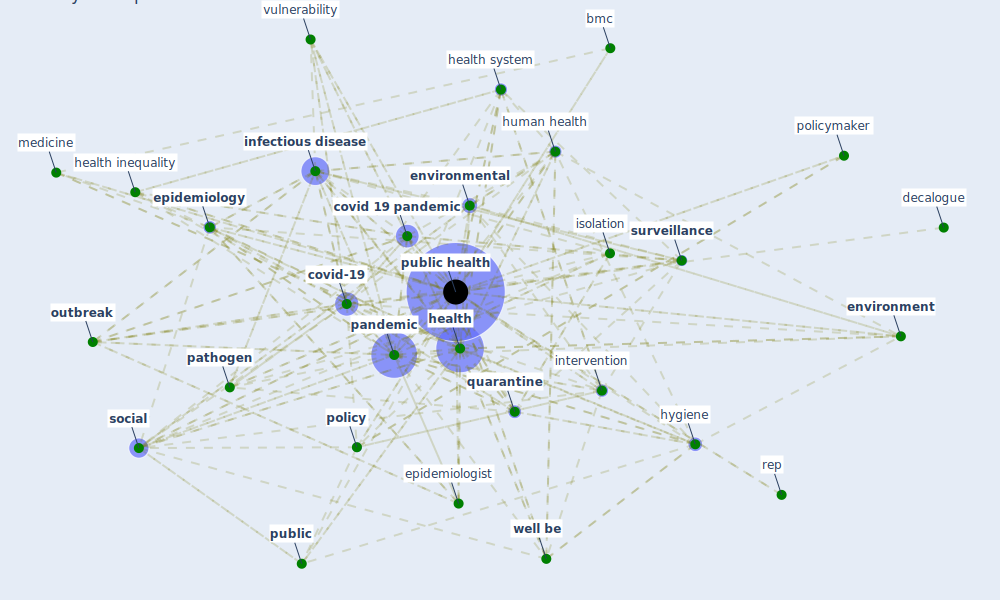

# Keyword: public health

## Keywords

 * air quality, bmc, [build environment](keyword_build_environment), [coronavirus](keyword_coronavirus), [covid 19 pandemic](keyword_covid_19_pandemic), [covid-19](keyword_covid-19), decalogue, [disease](keyword_disease), emergency, environ res public health, [environment](keyword_environment), [environmental](keyword_environmental), [epidemic](keyword_epidemic), [epidemiological](keyword_epidemiological), epidemiologist, [epidemiology](keyword_epidemiology), evidence base, executive order, exposure prevention, food, front, [government](keyword_government), [health](keyword_health), health and climate change, [health care](keyword_health_care), health care facility, health inequality, health issue, health policy, health problem, health report, health research community, health risk, health science, [health system](keyword_health_system), healthy, healthy community, [housing](keyword_housing), [human health](keyword_human_health), hygiene, inductive research, [infection](keyword_infection), [infectious disease](keyword_infectious_disease), infectious disease surveillance, infectious outbreak, infodemic, intervention, isolation, [malaria](keyword_malaria), medicine, [monitor](keyword_monitor), non contact, [nurse](keyword_nurse), official, [outbreak](keyword_outbreak), [pandemic](keyword_pandemic), pandemic control and prevention, [pathogen](keyword_pathogen), [physical](keyword_physical), [policy](keyword_policy), policymaker, port j, precautionary principle, preparedness, prevent the spread of the disease, [prevention](keyword_prevention), prevention and control, [public](keyword_public), public good, [public health](keyword_public_health), public health emergency, public health expert, public health policy, public health practitioner, public health vulnerability, public water, quality of life, [quarantine](keyword_quarantine), rep, [research](keyword_research), [restriction](keyword_restriction), risk factor, [safety](keyword_safety), [sanitation](keyword_sanitation), science, scientific evidence, [service](keyword_service), [social](keyword_social), socio economic, spread of disease, surveill, [surveillance](keyword_surveillance), [sustainable development](keyword_sustainable_development), [tourism](keyword_tourism), urban health planner, [urban planning](keyword_urban_planning), [vulnerability](keyword_vulnerability), [well be](keyword_well_be), world health organisation, [world health organization](keyword_world_health_organization)

## Mapping

## Neighbours

### Closest articles

* COVID-19 Could Leverage a Sustainable Built Environment - [LINK](article_pinheiro_covid-19_2020)
* Future perspectives of wastewater-based epidemiology: Monitoring infectious disease spread and resistance to the community level - [LINK](article_sims_future_2020)
* Prototype Early Warning Systems for Vector-Borne Diseases in Europe - [LINK](article_semenza_prototype_2015)
* Amplifying the role of knowledge translation platforms in the COVID-19 pandemic response - [LINK](article_el-jardali_amplifying_2020)
*  - [LINK](article_dalessandro_covid-19_2020)
* Health, Economic and Social Development Challenges of the COVID-19 Pandemic: Strategies for Multiple and Interconnected Issues - [LINK](article_panneer_health_2022)
* The impacts of knowledge, risk perception, emotion and information on citizens’ protective behaviors during the outbreak of COVID-19: a cross-sectional study in China - [LINK](article_ning_impacts_2020)
* Mental health economics: A prospective study on psychological flourishing and associations with healthcare costs and sickness benefit transfers in Denmark - [LINK](article_santini_mental_2021)
* Effects of temperature and humidity on the spread of COVID-19: A systematic review - [LINK](article_mecenas_effects_2020)
* Respiratory pandemics, urban planning and design: A multidisciplinary rapid review of the literature - [LINK](article_harris_respiratory_2022)

### Closest BPs

