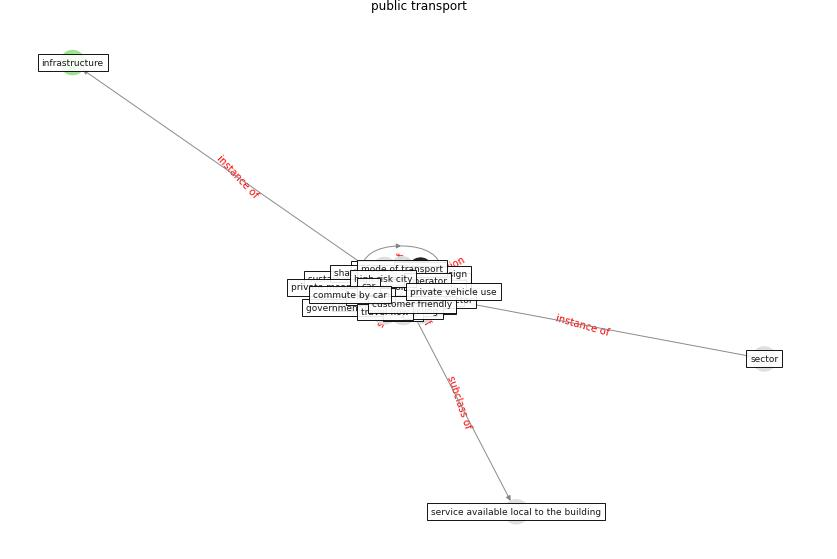

# Keyword: __public transport__

## Concepts

 

## Top articles for __public transport__
* Responsible Transport: A post-COVID agenda for
transport policy and practice ([budd_responsible_2020](article_budd_responsible_2020))
* Association of built environment attributes with the
spread of COVID-19 at its initial stage in China ([li_association_2021](article_li_association_2021))
* Mobility Behaviour in View of the Impact of the
COVID-19 Pandemic—Public Transport Users in
Gdansk Case Study ([przybylowski_mobility_2021](article_przybylowski_mobility_2021))
