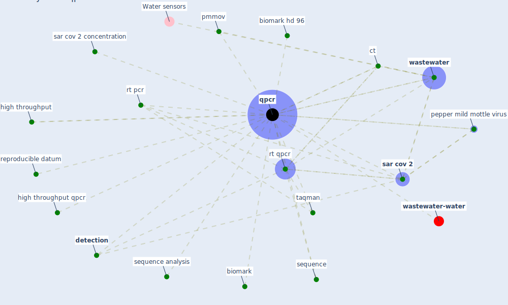

# Keyword: qpcr

* [wastewater-water](cluster_0)

## Keywords

 * Cluster_0, biomark, biomark hd 96, ct, [detection](keyword_detection), high throughput, high throughput qpcr, pepper mild mottle virus, pmmov, [qpcr](keyword_qpcr), reproducible datum, rt pcr, rt qpcr, [sar cov 2](keyword_sar_cov_2), sar cov 2 concentration, sequence, sequence analysis, taqman, [wastewater](keyword_wastewater)

## Mapping

## Neighbours

### Closest articles

* The removal of airborne SARS-CoV-2 and other microbial bioaerosols by air filtration on COVID-19 surge units - [LINK](article_conway-morris_removal_2021)
* SARS-CoV-2 Titers in Wastewater Are Higher than Expected from Clinically Confirmed Cases - [LINK](article_wu_sars-cov-2_2020)
* Future perspectives of wastewater-based epidemiology: Monitoring infectious disease spread and resistance to the community level - [LINK](article_sims_future_2020)
* First confirmed detection of SARS-CoV-2 in untreated wastewater in Australia: A proof of concept for the wastewater surveillance of COVID-19 in the community - [LINK](article_ahmed_first_2020)
* Wastewater-Based Epidemiology to monitor COVID-19 outbreak: Present and future diagnostic methods to be in your radar - [LINK](article_barcelo_wastewater-based_2020)
* SARS-CoV-2 RNA in wastewater anticipated COVID-19 occurrence in a low prevalence area - [LINK](article_randazzo_sars-cov-2_2020)
* Detection of SARS-CoV-2 in raw and treated wastewater in Germany – Suitability for COVID-19 surveillance and potential transmission risks - [LINK](article_westhaus_detection_2021)

### Closest BPs

