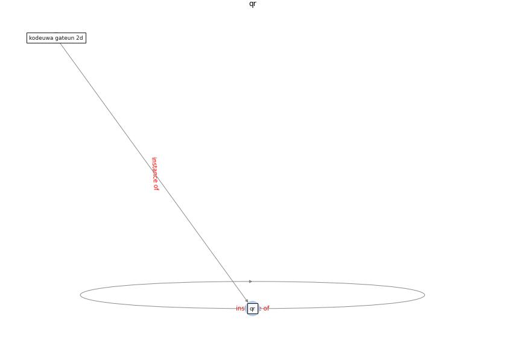

# Keyword: __qr__
## Clusters

* Cluster 1: [om-ai](cluster_1)

## Concepts

 

## Articles
* Design and Implementation of Entry-level COVID-19
Digital Signage Player supporting Fever
Detection, Face Mask Wearing Detection and
KI-pass QR Code Checking ([huy-tran_design_2022](article_huy-tran_design_2022))
* Design and Implementation of Entry-level COVID-19
Digital Signage Player supporting Fever
Detection, Face Mask Wearing Detection and
KI-pass QR Code Checking ([huy-tran_design_2022](article_huy-tran_design_2022))
* RUDDS_bioRxiv_update-0 ([RUDDS_bioRxiv_update-0](article_RUDDS_bioRxiv_update-0))
* realdania_refleksioner_2022_EN-150 ([realdania_refleksioner_2022_EN-150](article_realdania_refleksioner_2022_EN-150))
* realdania_refleksioner_2022_EN-1400 ([realdania_refleksioner_2022_EN-1400](article_realdania_refleksioner_2022_EN-1400))
* realdania_refleksioner_2022_EN-1350 ([realdania_refleksioner_2022_EN-1350](article_realdania_refleksioner_2022_EN-1350))
* realdania_refleksioner_2022_EN-1300 ([realdania_refleksioner_2022_EN-1300](article_realdania_refleksioner_2022_EN-1300))
* realdania_refleksioner_2022_EN-1250 ([realdania_refleksioner_2022_EN-1250](article_realdania_refleksioner_2022_EN-1250))
* realdania_refleksioner_2022_EN-1200 ([realdania_refleksioner_2022_EN-1200](article_realdania_refleksioner_2022_EN-1200))
* realdania_refleksioner_2022_EN-1150 ([realdania_refleksioner_2022_EN-1150](article_realdania_refleksioner_2022_EN-1150))
