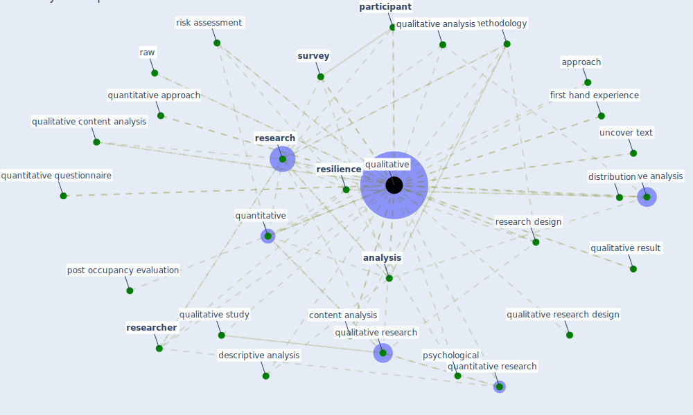

# Keyword: qualitative

## Keywords

 * academic praxis, [analysis](keyword_analysis), analysis of risk of bias, analyze, analyze the collect datum, approach, building certificate, case study, code, code manual, code technique, collaborative biography, collective writing, comparison, content analysis, descriptive, descriptive analysis, descriptive distribution, distribution, feedback, first hand experience, form, human resource, indicative poe, inductive research, interview, longitudinal, marketing research, [measure](keyword_measure), methodology, narrative, [participant](keyword_participant), participatory research, perception, post occupancy evaluation, [psychological](keyword_psychological), [qualitative](keyword_qualitative), qualitative analysis, qualitative content analysis, qualitative research, qualitative research design, qualitative result, qualitative study, [quality](keyword_quality), quality information, quantitative, quantitative analysis, quantitative approach, quantitative approach to research, quantitative datum, quantitative feedback, quantitative method, quantitative questionnaire, quantitative research, quantitative sampling, quantitatively, quantitativequalitative, raw, raw response, [research](keyword_research), research design, research interview, research method, research question, [researcher](keyword_researcher), [resilience](keyword_resilience), resilience assessment, resilience research, risk assessment, risk level, saldaña, [sample](keyword_sample), selection, [simulation](keyword_simulation), statistical, [study](keyword_study), [survey](keyword_survey), technique, [theme](keyword_theme), uncover text, valid, varieffect, varieffect of impact

## Mapping

## Neighbours

### Closest articles

* A Mixed Approach on Resilience of Spanish Dwellings and Households during COVID-19 Lockdown - [LINK](article_cuerdo-vilches_mixed_2020)
* Influence between COVID-19 Impacts and Project Stakeholders in Chilean Construction Projects - [LINK](article_araya_influence_2021)
* Management of the COVID-19 pandemic: challenges, practices, and organizational support - [LINK](article_hossny_management_2022)
* Startups in times of crisis – A rapid response to the COVID-19 pandemic - [LINK](article_kuckertz_startups_2020)
* A review of definitions and measures of system resilience - [LINK](article_hosseini_review_2016)
* Health, Wellbeing \& Productivity in Offices - [LINK](article_world_green_building_council_health_2014)
* Biophilic design in architecture and its contributions to health, well-being, and sustainability: A critical review - [LINK](article_zhong_biophilic_2022)
* The Impact of Pandemic Crisis on the Survival of Construction Industry: A Case of COVID-19 - [LINK](article_gamil_impact_2020)
* Mapping research in logistics and supply chain management during COVID-19 pandemic - [LINK](article_montoya-torres_mapping_2021)
* The City Under COVID‐19: Podcasting As Digital Methodology - [LINK](article_rogers_city_2020)

### Closest BPs

