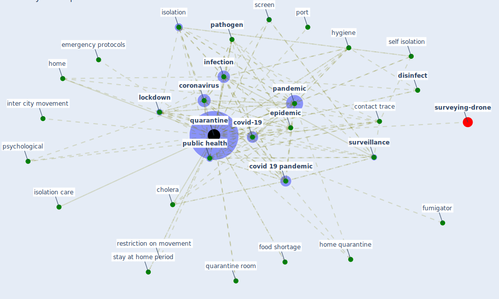

# Keyword: quarantine

* [surveying-drone](cluster_13)

## Keywords

 * 2 week, cargo, [case](keyword_case), [cholera](keyword_cholera), contact trace, containment, containment measure, [coronavirus](keyword_coronavirus), coronavirus quarantine, [covid 19 pandemic](keyword_covid_19_pandemic), covid 19 quarantine, [covid-19](keyword_covid-19), [disinfect](keyword_disinfect), [disinfection](keyword_disinfection), distance, emergency protocols, [epidemic](keyword_epidemic), epidemic preparedness, extraordinary containment measure, effect, food shortage, fumigator, [health](keyword_health), health official, hkr, [home](keyword_home), home quarantine, [hospital](keyword_hospital), hygiene, inap propriate facility, incubation period, [infect](keyword_infect), [infection](keyword_infection), [infectious](keyword_infectious), [infectious disease](keyword_infectious_disease), infectious disease outbreak, infectivity, infector, inter city movement, isolation, isolation area, isolation care, isolation unit, [kazakhstan](keyword_kazakhstan), laboratory diagnosis, [lockdown](keyword_lockdown), lockdown community, lockdown lifestyle, lockdown of wuhan, monitoring system, negative control animal, oblige, open office, [pandemic](keyword_pandemic), [pathogen](keyword_pathogen), police, port, potentially infect, prevent the spreading of the virus, preventive measure, protection, protection and response measure, [psychological](keyword_psychological), [public health](keyword_public_health), [quarantine](keyword_quarantine), quarantine room, quarantine rule, quarantined, quarantines, quarantining, rapid review of the evidence, [recovery](keyword_recovery), [response](keyword_response), restriction on movement, rouhanizadeh, rule, screen, se paration, self isolation, [smart](keyword_smart), smart quarantine, smart speaker, [south korea](keyword_south_korea), stay at home period, strict, [surveillance](keyword_surveillance), surveillance technology, travel restriction, treat, [treatment](keyword_treatment), unemployment, [united kingdom](keyword_united_kingdom), unrestricted movement, venezuela, venice, [virus](keyword_virus), virus transmission, virus transmission chain, [wuhan](keyword_wuhan), xiangyang

## Mapping

## Neighbours

### Closest articles

* Prophylactic Architecture: Formulating the Concept of Pandemic-Resilient Homes - [LINK](article_elrayies_prophylactic_2022)
* How is COVID-19 Experience Transforming Sustainability Requirements of Residential Buildings? A Review - [LINK](article_tokazhanov_how_2020)
* COVID-19 Could Leverage a Sustainable Built Environment - [LINK](article_pinheiro_covid-19_2020)
* Readiness Assessment of Green Building Certification Systems for Residential Buildings during Pandemics - [LINK](article_tleuken_readiness_2021)
* Design COVID-19 Ontology: A Healthcare and Safety Perspective - [LINK](article_aloulou_design_2022)
* How the 5G Enabled the COVID-19 Pandemic Prevention and Control: Materiality, Affordance, and (De-)Spatialization - [LINK](article_li_how_2022)
* Contributions of Smart City Solutions and Technologies to Resilience against the COVID-19 Pandemic: A Literature Review - [LINK](article_sharifi_contributions_2021)
* Mobile Technology Solution for COVID-19: Surveillance and Prevention - [LINK](article_raza_mobile_2021)
* 2020 Data Protection Report - [LINK](article_council_of_europe_2020_2020)
* Toilets dominate environmental detection of SARS-CoV-2 virus in a hospital - [LINK](article_ding_toilets_2020)

### Closest BPs

