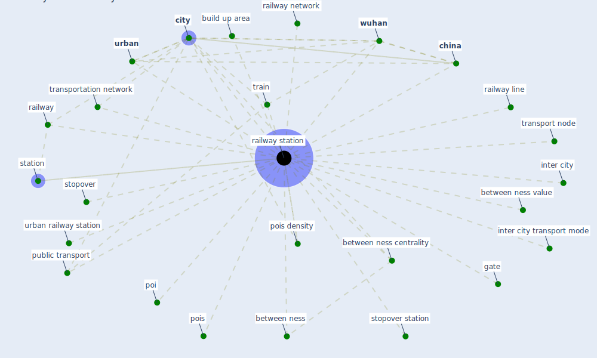

# Keyword: railway station

## Keywords

 * between ness, between ness centrality, between ness value, build up area, [china](keyword_china), [city](keyword_city), [gate](keyword_gate), inter city, inter city transport mode, poi, pois, pois density, [public transport](keyword_public_transport), railway, railway line, railway network, [railway station](keyword_railway_station), railway stations, station, stopover, stopover station, train, transport node, transportation network, [urban](keyword_urban), urban railway station, [wuhan](keyword_wuhan)

## Mapping

## Neighbours

### Closest articles

* Association of built environment attributes with the spread of COVID-19 at its initial stage in China - [LINK](article_li_association_2021)
* Health, Wellbeing \& Productivity in Offices - [LINK](article_world_green_building_council_health_2014)
* Design COVID-19 Ontology: A Healthcare and Safety Perspective - [LINK](article_aloulou_design_2022)
* How the 5G Enabled the COVID-19 Pandemic Prevention and Control: Materiality, Affordance, and (De-)Spatialization - [LINK](article_li_how_2022)

### Closest BPs

