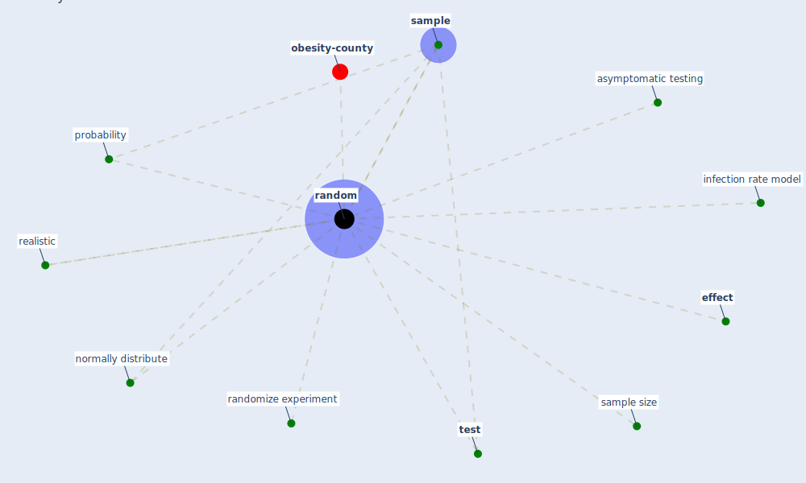

# Keyword: random

* [obesity-county](cluster_9)

## Keywords

 * Cluster_9, asymptomatic testing, [effect](keyword_effect), infection rate model, normally distribute, probability, [random](keyword_random), randomize experiment, realistic, [sample](keyword_sample), sample size, [test](keyword_test)

## Mapping

## Neighbours

### Closest articles

* Treating two pandemics for the price of one: Chronic and infectious disease impacts of the built and natural environment - [LINK](article_frank_treating_2021)
* Understanding the role of urban design in disease spreading - [LINK](article_brizuela_understanding_2019)
* Retail Signage During the COVID-19 Pandemic - [LINK](article_mcneish_retail_2020)
* Validity of energy social research during and after COVID-19: challenges, considerations, and responses - [LINK](article_fell_validity_2020)
* Study of COVID-19 pandemic in London (UK) from urban context - [LINK](article_ghosh_study_2020)
* COVID-19 Prevention and Control Measures in Workplace Settings: A Rapid Review and Meta-Analysis - [LINK](article_ingram_covid-19_2021)
* The effect of occupant distribution on energy consumption and COVID-19 infection in buildings: A case study of university building - [LINK](article_mokhtari_effect_2021)
* The Effects of Pandemic on Construction Industry in the UK - [LINK](article_shibani_effects_2020)

### Closest BPs

