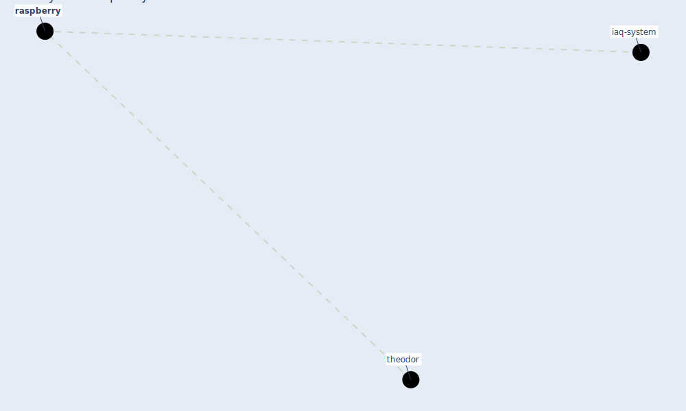

# Keyword: raspberry

* [iaq-system](cluster_3)

## Keywords

 * Cluster_3, [raspberry](keyword_raspberry), theodor

## Mapping

## Neighbours

### Closest articles

* Scalable IoT Architecture for Monitoring IEQ Conditions in Public and Private Buildings - [LINK](article_calvo_scalable_2022)

### Closest BPs

