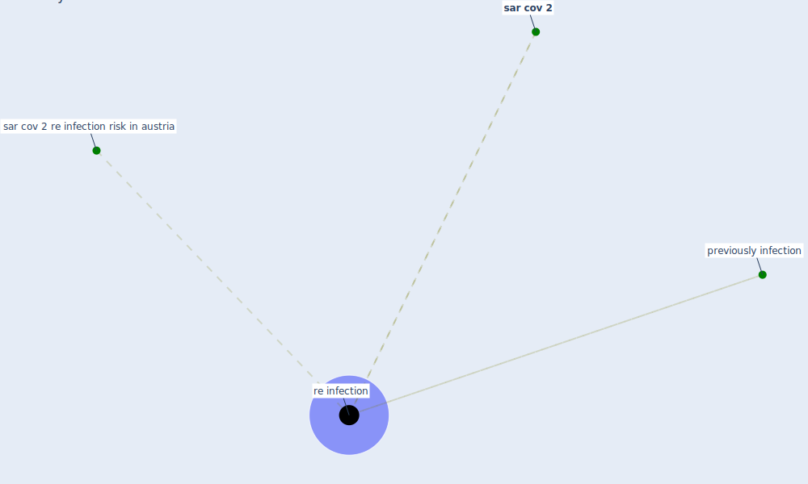

# Keyword: re infection

## Keywords

 * previously infection, [re infection](keyword_re_infection), re infections, [sar cov 2](keyword_sar_cov_2), sar cov 2 re infection risk in austria

## Mapping

## Neighbours

### Closest articles

* Contributions to the mitigation of the COVID-19 pandemic - [LINK](article_pilz_contributions_2022)

### Closest BPs

