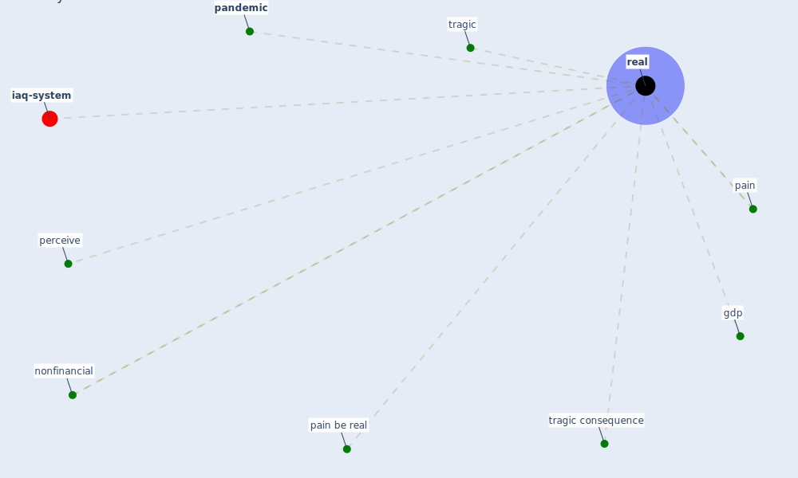

# Keyword: real

* [iaq-system](cluster_3)

## Keywords

 * Cluster_3, gdp, nonfinancial, pain, pain be real, [pandemic](keyword_pandemic), perceive, [real](keyword_real), tragic, tragic consequence

## Mapping

## Neighbours

### Closest articles

* How loneliness is talked about in social media during COVID-19 pandemic: Text mining of 4,492 Twitter feeds - [LINK](article_koh_how_2022)
* COVID-19 misinformation: Accuracy of articles about coronavirus prevention mostly shared on social media - [LINK](article_obiala_covid-19_2021)
* World Bank Development Report - [LINK](article_world_bank_world_2022)
* Should I Stay or Should I Go? Tourists’ COVID-19 Risk Perception and Vacation Behavior Shift - [LINK](article_bratic_should_2021)
* Global value chains: Efficiency and risks in the context of COVID-19 - [LINK](article_oecd_global_2021)
* The efficacy of social distance and ventilation effectiveness in preventing COVID-19 transmission - [LINK](article_sun_efficacy_2020)

### Closest BPs

