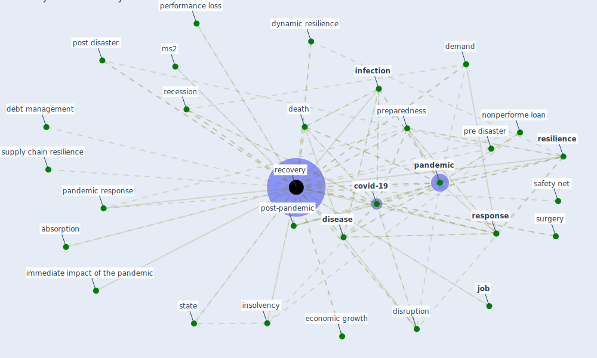

# Keyword: recovery

## Keywords

 * absorption, [adaptation](keyword_adaptation), adaptive and restorative capacity, banking system, bottom up, [case](keyword_case), [construction](keyword_construction), construction technology, [covid-19](keyword_covid-19), crisis management cycle, cumulative infection, cyber incident, death, debt, debt level, debt load, debt management, demand, direct support, disaster management, disaster risk, [disease](keyword_disease), disruption, drug supply, dynamic resilience, economic development, economic growth, economic recovery, eurozone crisis, [fatality](keyword_fatality), from pandemic to recovery, functionality, [green](keyword_green), immediate impact of the pandemic, [infection](keyword_infection), insolvency, insolvency framework, [job](keyword_job), level of recovery, loan, low income economy, man hour, mgv, middle income economy, ms2, nonperforme loan, normality, [oecd](keyword_oecd), operation, [pandemic](keyword_pandemic), pandemic response, performance loss, phage, phage 109, [plan](keyword_plan), planning after the pandemic, policy priority, policy priority for the recovery, post disaster, post disaster recovery, post-pandemic, pre disaster, preparedness, preparedness action, prop up unviable borrower, psycho physiological, [quarantine](keyword_quarantine), recession, recoveries, [recovery](keyword_recovery), recovery curve, recovery effort, recovery plan, recovery process, rehabilitation, repair, [resilience](keyword_resilience), resilient, resolution, resolution planning, [response](keyword_response), safety net, so should be the recovery, [state](keyword_state), stimulus, supply chain recovery, supply chain resilience, [surgery](keyword_surgery), [sustainability](keyword_sustainability), [sustainable energy transition](keyword_sustainable_energy_transition), sustainable infrastructure, temporary, the pandemic, [time](keyword_time), uncertainty, unequal, unviable borrower, volume, volume of sample process

## Mapping

## Neighbours

### Closest articles

* World Bank Development Report - [LINK](article_world_bank_world_2022)
* A review of definitions and measures of system resilience - [LINK](article_hosseini_review_2016)
* Contributions of Smart City Solutions and Technologies to Resilience against the COVID-19 Pandemic: A Literature Review - [LINK](article_sharifi_contributions_2021)
* Mitigation strategies and compliance in the COVID-19 fight; how much compliance is enough? - [LINK](article_mukerjee_mitigation_2021)
* The COVID-19 pandemic: Impacts on cities and major lessons for urban planning, design, and management - [LINK](article_sharifi_covid-19_2020)
* The COVID-19 pandemic: Lessons on building more equal and sustainable societies - [LINK](article_van_barneveld_covid-19_2020)
* Presence of SARS-Coronavirus-2 RNA in Sewage and Correlation with Reported COVID-19 Prevalence in the Early Stage of the Epidemic in The Netherlands - [LINK](article_medema_presence_2020)
* Covid-19 and the politics of sustainable energy transitions - [LINK](article_kuzemko_covid-19_2020)
* Preparing critical infrastructure for the future: Lessons learnt from the Covid-19 pandemic - [LINK](article_tomalska_preparing_2022)
* Learning from the COVID-19 pandemic in governing smart cities - [LINK](article_bolivar_learning_2022)

### Closest BPs

