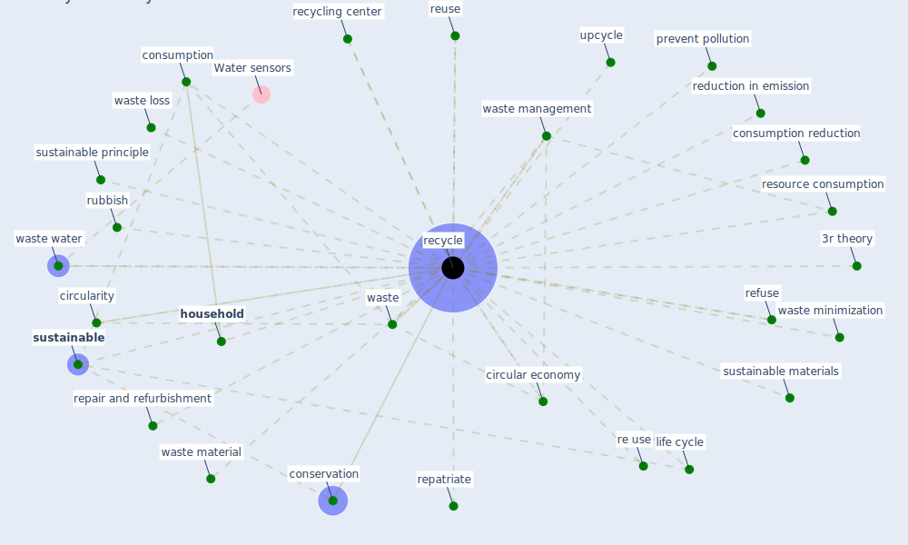

# Keyword: recycle

## Keywords

 * 3r theory, [circular economy](keyword_circular_economy), circularity, conservation, conservation recycling, consumption, consumption reduction, container, e waste, green technology, [household](keyword_household), household recycling, life cycle, [material](keyword_material), more responsible consumption, prevent pollution, re use, [recycle](keyword_recycle), recycled, recycling, recycling center, reduction in emission, refuse, repair and refurbishment, repatriate, resource consumption, reuse, rubbish, [sustainable](keyword_sustainable), sustainable materials, sustainable principle, upcycle, waste, waste loss, waste management, waste material, waste minimization, waste water

## Mapping

## Neighbours

### Closest articles

* A critical analysis of the impacts of COVID-19 on the global economy and ecosystems and opportunities for circular economy strategies - [LINK](article_ibn-mohammed_critical_2021)
* Indirect effects of COVID-19 on the environment - [LINK](article_zambrano-monserrate_indirect_2020)
* Propositions for a Resilient, Post-COVID-19 Future for the AEC Industry - [LINK](article_nassereddine_propositions_2021)
* Effects to Construction Project Management Impacted Circular Economic of Covid-19 Pandemic - [LINK](article_paikan_effects_2021)
* How is COVID-19 Experience Transforming Sustainability Requirements of Residential Buildings? A Review - [LINK](article_tokazhanov_how_2020)
* Readiness Assessment of Green Building Certification Systems for Residential Buildings during Pandemics - [LINK](article_tleuken_readiness_2021)
* COVID-19 and Green Housing: A Review of Relevant Literature - [LINK](article_kaklauskas_covid-19_2021)
* COVID-19 Could Leverage a Sustainable Built Environment - [LINK](article_pinheiro_covid-19_2020)
* COVID-19 and the UN Sustainable Development Goals: Threat to Solidarity or an Opportunity? - [LINK](article_leal_filho_covid-19_2020)
* Decision Making within the Built Environment as a Strategy for Mitigating the Risk of Malaria and Other Vector-Borne Diseases - [LINK](article_obonyo_decision_2018)

### Closest BPs

