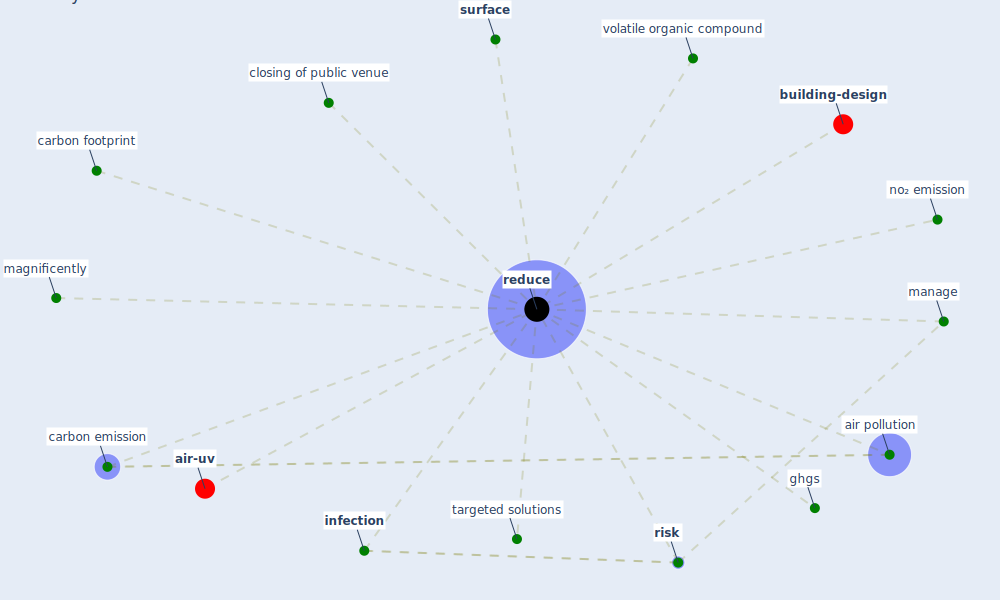

# Keyword: reduce

* [building-design](cluster_5)

* [air-uv](cluster_10)

## Keywords

 * Cluster_10, Cluster_5, [air pollution](keyword_air_pollution), carbon emission, carbon footprint, closing of public venue, ghgs, [infection](keyword_infection), magnificently, manage, no₂ emission, [reduce](keyword_reduce), reduced, reduces, reducing, [risk](keyword_risk), [surface](keyword_surface), targeted solutions, volatile organic compound

## Mapping

## Neighbours

### Closest articles

* Nurture to nature via COVID-19, a self-regenerating environmental strategy of environment in global context - [LINK](article_paital_nurture_2020)
* Designing Post COVID-19 Buildings: Approaches for Achieving Healthy Buildings - [LINK](article_navaratnam_designing_2022)
* COVID-19 Could Leverage a Sustainable Built Environment - [LINK](article_pinheiro_covid-19_2020)
* Assessment method for new sustainability indicators providing pandemic resilience for residential buildings - [LINK](article_tokazhanov_assessment_2021)
* A Review on Building Design as a Biomedical System for Preventing COVID-19 Pandemic - [LINK](article_amran_review_2022)
* Navigating Climate Change: Rethinking the Role of Buildings - [LINK](article_cole_navigating_2020)
* COVID-19 risks and systemic gaps in Nigeria: resilience building lessons for pandemic and climate change management - [LINK](article_lawal_covid-19_2022)
* Making green infrastructure healthier infrastructure - [LINK](article_lohmus_making_2015)
* The COVID-19 pandemic: Impacts on cities and major lessons for urban planning, design, and management - [LINK](article_sharifi_covid-19_2020)

### Closest BPs

