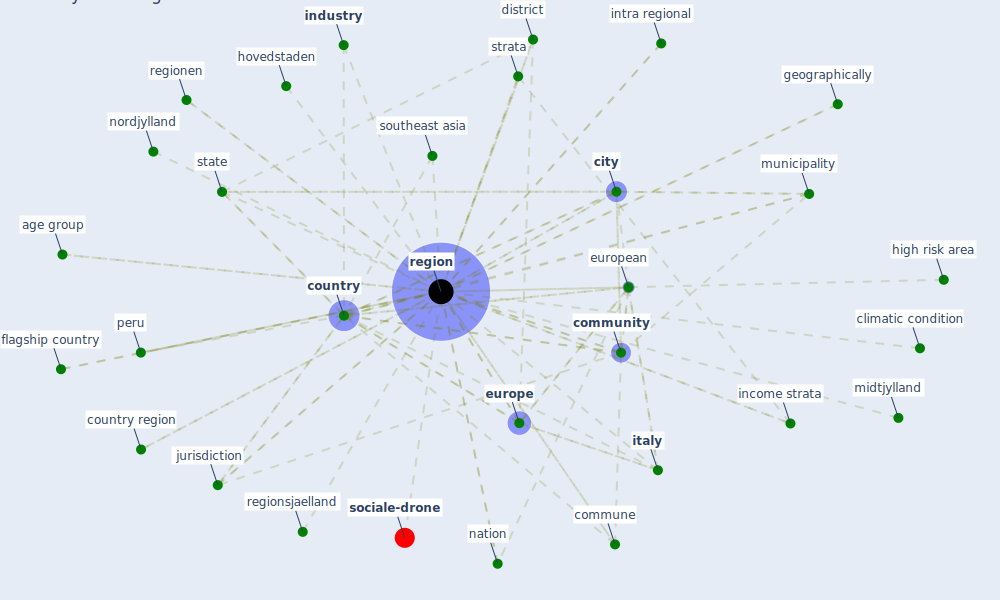

# Keyword: region

* [sociale-drone](cluster_6)

## Keywords

 * Cluster_6, [africa](keyword_africa), [age group](keyword_age_group), america, asia, asia pacific, asian, asian region, [city](keyword_city), climatic condition, climatic condition of the region in the mention period, commune, [community](keyword_community), [coronavirus](keyword_coronavirus), [country](keyword_country), country region, [county](keyword_county), [danish](keyword_danish), [denmark](keyword_denmark), district, east africa, eca, economic status, emilia romagna, [europe](keyword_europe), european, flagship country, geographically, geography, gep, high risk area, hovedstaden, hubei province, income strata, [industry](keyword_industry), intra regional, [italy](keyword_italy), jurisdiction, kavango, locality, lombardy, low income country, mexico, middleeast and north africa, midtjylland, midwest, [milan](keyword_milan), [montenegro](keyword_montenegro), municipality, nation, [nordjylland](keyword_nordjylland), osm database, paris, [peru](keyword_peru), polygon, positive case, [region](keyword_region), region hovedstaden, region subj income status, regionen, regions, regionsjaelland, resource poor, rural, [school](keyword_school), sjælland, southeast asia, spatially, specificitie, [state](keyword_state), strata, sub saharan africa, subregion, sustainable tourism, territory, tropical, tuscany, [urban](keyword_urban), urban area, urban region, wastewater treatment, wastewater treatment facility, øger beredskab

## Mapping

## Neighbours

### Closest articles

* Pandemiens arkitektur - [LINK](article_realdania_pandemiens_2022)
* The impact of COVID-19 and strategies for mitigation and suppression in low- and middle-income countries - [LINK](article_walker_impact_2020)
* The socio-economic determinants of COVID-19: A spatial analysis of German county level data - [LINK](article_ehlert_socio-economic_2021)
* Urban planning after COVID-19 - [LINK](article_rtpi_urban_2021)
* COVID-19: IMPACT OF THE PANDEMIC ON THE SUSTAINABLE DEVELOPMENT GOALS - [LINK](article_samout_covid-19_2020)
* The impacts of knowledge, risk perception, emotion and information on citizens’ protective behaviors during the outbreak of COVID-19: a cross-sectional study in China - [LINK](article_ning_impacts_2020)
* World Bank Development Report - [LINK](article_world_bank_world_2022)
* Global value chains: Efficiency and risks in the context of COVID-19 - [LINK](article_oecd_global_2021)
* Integrating rapid risk mapping and mobile phone call record data for strategic malaria elimination planning - [LINK](article_tatem_integrating_2014)
* The Impact of COVID-19 on Public Space: A Review of the Emerging Questions - [LINK](article_honey-roses_impact_2020)

### Closest BPs

