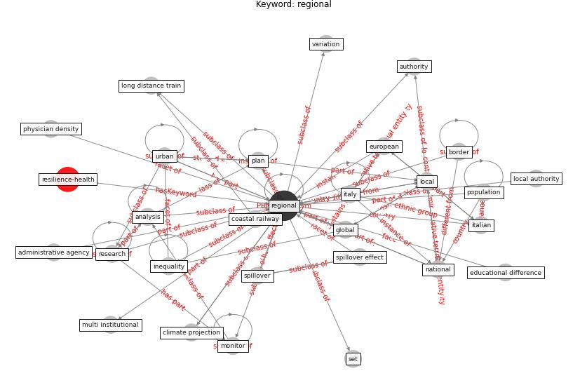

# Keyword: regional

* [resilience-health](cluster_Cluster_13)

## Keywords

 * Cluster_13, administrative agency, analysis, authority, border, climate projection, coastal railway, educational difference, european, [global](keyword_global), inequality, italian, [italy](keyword_italy), local, local authority, long distance train, [monitor](keyword_monitor), multi institutional, national, physician density, [plan](keyword_plan), [population](keyword_population), [regional](keyword_regional), [research](keyword_research), set, spillover, [spillover effect](keyword_spillover_effect), [urban](keyword_urban), variation

## Concepts

 

## Neighbours

### Closest articles

* The socio-economic determinants of COVID-19: A spatial analysis of German county level data - [LINK](article_ehlert_socio-economic_2021)
* Learning from the COVID-19 pandemic in governing smart cities - [LINK](article_bolivar_learning_2022)
* Perception of COVID-19 impacts on the construction industry over time - [LINK](article_rokooei_perception_2022)
* The impact of climate change on the epidemiology and control of Rift Valley fever - PubMed - [LINK](article_martin_impact_2008)
* How the Coronavirus Will Reshape Architecture - [LINK](article_chayka_how_2020)
* The Impact of COVID-19 on Public Space: A Review of the Emerging Questions - [LINK](article_honey-roses_impact_2020)
* The impacts of knowledge, risk perception, emotion and information on citizens’ protective behaviors during the outbreak of COVID-19: a cross-sectional study in China - [LINK](article_ning_impacts_2020)
* Using Technology to Maintain the Education of Residents During the COVID-19 Pandemic - [LINK](article_chick_using_2020)
* Case Study on Finnish TVETA Resilient Model of Training During COVID-19 - [LINK](article_unesco_case_2021)

### Closest BPs

