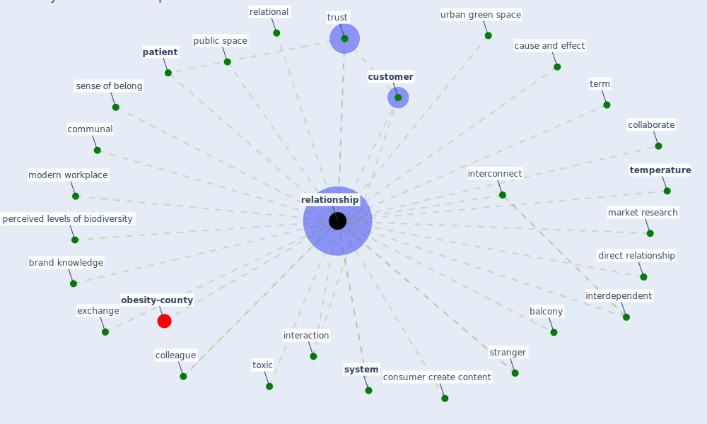

# Keyword: relationship

* [obesity-county](cluster_9)

## Keywords

 * Cluster_9, abuser, [balcony](keyword_balcony), brand knowledge, causal, cause and effect, co creation, cognitive trust, collaborate, colleague, communal, company culture, consumer create content, [customer](keyword_customer), deterministic, direct relationship, [employee](keyword_employee), exchange, exchange aspect, exposure response, independence of observation, individual, inheritance, [interaction](keyword_interaction), interconnect, interdependent, market research, modern workplace, [patient](keyword_patient), perceived levels of biodiversity, [public space](keyword_public_space), relational, [relationship](keyword_relationship), relationships, sense of belong, stranger, [system](keyword_system), [temperature](keyword_temperature), term, toxic, trust, [urban green space](keyword_urban_green_space)

## Mapping

## Neighbours

### Closest articles

* How COVID-19 Could Accelerate the Adoption of New Retail Technologies and Enhance the (E-)Servicescape - [LINK](article_willems_how_2021)
* The Impact of COVID-19 on Public Space: A Review of the Emerging Questions - [LINK](article_honey-roses_impact_2020)
* Health, Wellbeing \& Productivity in Offices - [LINK](article_world_green_building_council_health_2014)
* Navigating Climate Change: Rethinking the Role of Buildings - [LINK](article_cole_navigating_2020)
* Questioning the use of the balcony in apartments during the COVID-19 pandemic process - [LINK](article_aydin_questioning_2020)
* It’s time to reimagine where and how work will get done (PwC’s US Remote Work Survey) - [LINK](article_pricewaterhousecoopers_its_2021)
* COVID-19: IMPACT OF THE PANDEMIC ON THE SUSTAINABLE DEVELOPMENT GOALS - [LINK](article_samout_covid-19_2020)
* Green infrastructure through the lens of “One Health”: A systematic review and integrative framework uncovering synergies and trade-offs between mental health and wildlife support in cities - [LINK](article_felappi_green_2020)
* Influence between COVID-19 Impacts and Project Stakeholders in Chilean Construction Projects - [LINK](article_araya_influence_2021)
* An Overview of Biomedical Ontologies for Pandemics and Infectious Diseases Representation - [LINK](article_bayoudhi_overview_2021)

### Closest BPs

