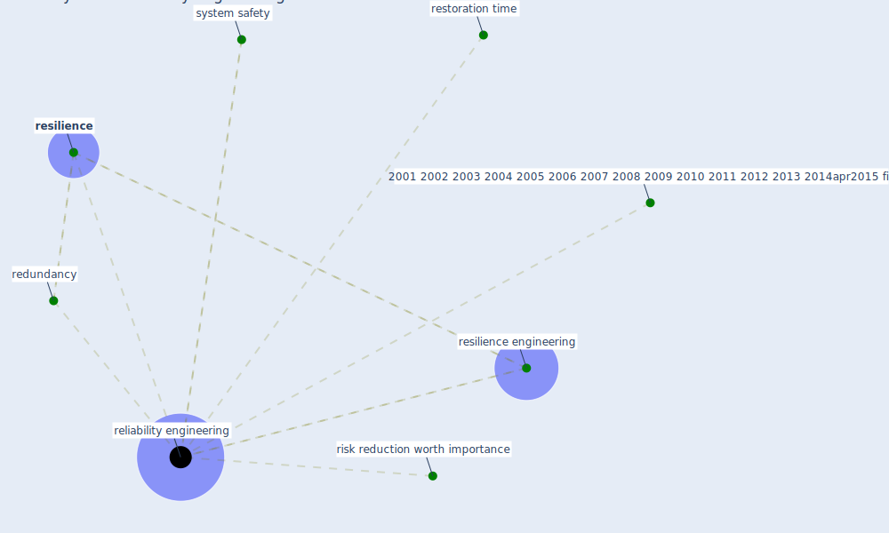

# Keyword: reliability engineering

## Keywords

 * 2001 2002 2003 2004 2005 2006 2007 2008 2009 2010 2011 2012 2013 2014apr2015 fig, redundancy, [reliability engineering](keyword_reliability_engineering), [resilience](keyword_resilience), resilience engineering, restoration time, risk reduction worth importance, system safety

## Mapping

## Neighbours

### Closest articles

* A review of definitions and measures of system resilience - [LINK](article_hosseini_review_2016)
* Preparing critical infrastructure for the future: Lessons learnt from the Covid-19 pandemic - [LINK](article_tomalska_preparing_2022)

### Closest BPs

