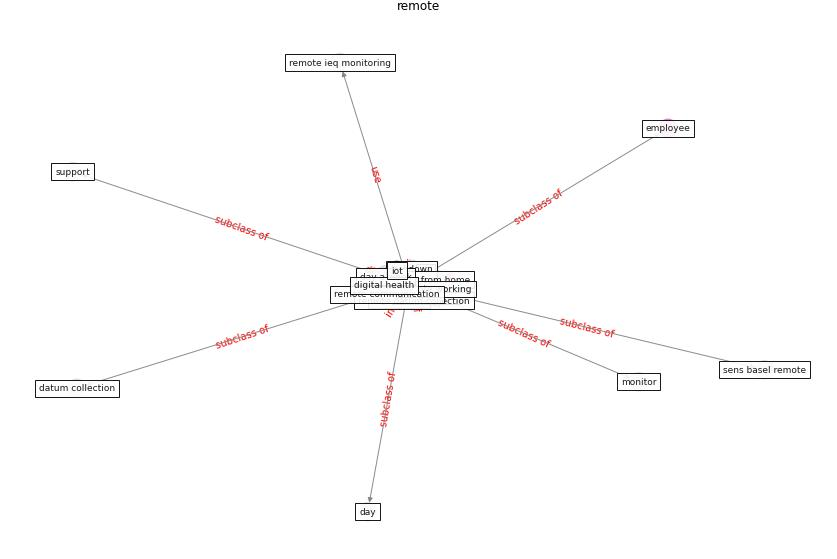

# Keyword: __remote__
## Clusters

* Cluster 6: [smart-iot](cluster_6)

## Concepts

 

## Articles
* pricewaterhousecoopers_its_2021 ([pricewaterhousecoopers_its_2021](article_pricewaterhousecoopers_its_2021))
* COVID-19: A new digital dawn? ([robbins_covid-19_2020](article_robbins_covid-19_2020))
* Scalable IoT Architecture for Monitoring IEQ
Conditions in Public and Private Buildings ([calvo_scalable_2022](article_calvo_scalable_2022))
* How the 5G Enabled the COVID-19 Pandemic
Prevention and Control: Materiality, Affordance,
and (De-)Spatialization ([li_how_2022](article_li_how_2022))
* Wastewater surveillance for population-wide Covid-19:
The present and future ([daughton_wastewater_2020](article_daughton_wastewater_2020))
* Design COVID-19 Ontology: A Healthcare and
Safety Perspective ([aloulou_design_2022](article_aloulou_design_2022))
* Identifying Actions to Control and Mitigate the
Effects of the COVID-19 Pandemic on Construction
Organizations: Preliminary Findings ([raoufi_identifying_2021](article_raoufi_identifying_2021))
* Impacts of COVID-19 on Health and Safety of
Workforce in Construction Industry ([pamidimukkala_impacts_2021](article_pamidimukkala_impacts_2021))
* A review of facilities management interventions to
mitigate respiratory infections in existing buildings ([zhang_review_2022](article_zhang_review_2022))
* The COVID-19 pandemic: Impacts on cities and major
lessons for urban planning, design, and management ([sharifi_covid-19_2020](article_sharifi_covid-19_2020))
