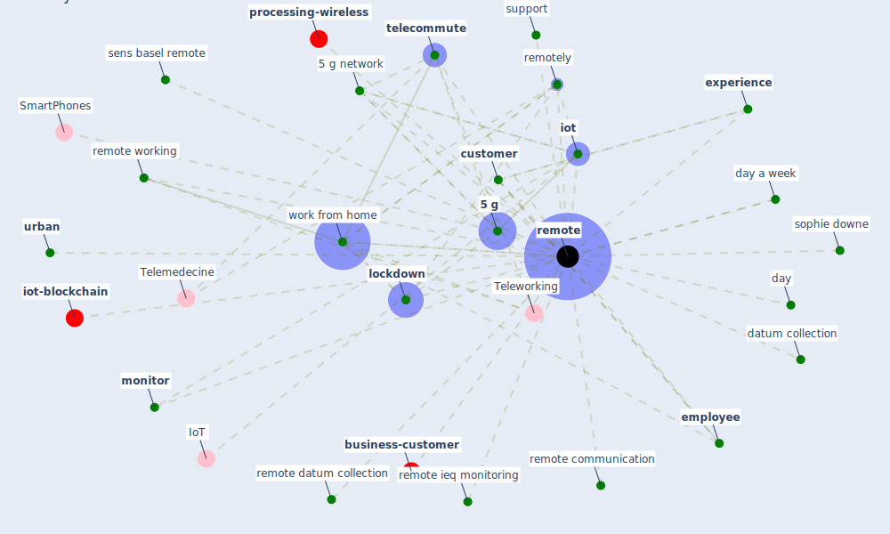

# Keyword: remote

* [iot-blockchain](cluster_7)

* [business-customer](cluster_11)

* [processing-wireless](cluster_14)

## Keywords

 * [5 g](keyword_5_g), [5 g network](keyword_5_g_network), Cluster_11, Cluster_14, Cluster_7, [customer](keyword_customer), datum collection, day, day a week, [employee](keyword_employee), [experience](keyword_experience), [iot](keyword_iot), [lockdown](keyword_lockdown), [monitor](keyword_monitor), [remote](keyword_remote), remote communication, remote datum collection, remote ieq monitoring, remote working, remotely, sens basel remote, sophie downe, support, [telecommute](keyword_telecommute), [urban](keyword_urban), work from home

## Mapping

## Neighbours

### Closest articles

* It’s time to reimagine where and how work will get done (PwC’s US Remote Work Survey) - [LINK](article_pricewaterhousecoopers_its_2021)
* How COVID-19 Could Accelerate the Adoption of New Retail Technologies and Enhance the (E-)Servicescape - [LINK](article_willems_how_2021)
* Design COVID-19 Ontology: A Healthcare and Safety Perspective - [LINK](article_aloulou_design_2022)
* Scalable IoT Architecture for Monitoring IEQ Conditions in Public and Private Buildings - [LINK](article_calvo_scalable_2022)
* Wastewater surveillance for population-wide Covid-19: The present and future - [LINK](article_daughton_wastewater_2020)
* How the 5G Enabled the COVID-19 Pandemic Prevention and Control: Materiality, Affordance, and (De-)Spatialization - [LINK](article_li_how_2022)
* Impacts of COVID-19 on Health and Safety of Workforce in Construction Industry - [LINK](article_pamidimukkala_impacts_2021)
* Identifying Actions to Control and Mitigate the Effects of the COVID-19 Pandemic on Construction Organizations: Preliminary Findings - [LINK](article_raoufi_identifying_2021)
* Guidelines for Responding to COVID-19 Pandemic: Best Practices, Impacts, and Future Research Directions - [LINK](article_assaad_guidelines_2021)

### Closest BPs

