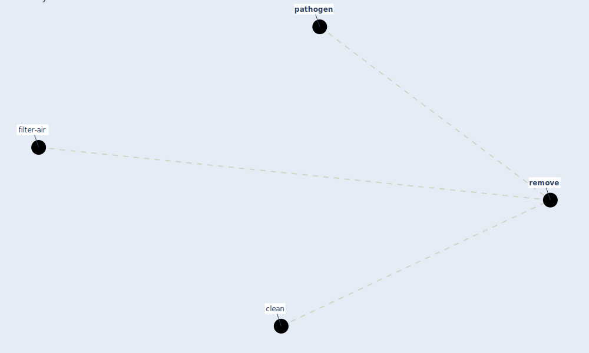

# Keyword: remove

* [filter-air](cluster_0)

## Keywords

 * Cluster_0, [clean](keyword_clean), [pathogen](keyword_pathogen), [remove](keyword_remove)

## Mapping

## Neighbours

### Closest articles

* Indoor Air Quality: Rethinking rules of building design strategies in post-pandemic architecture - [LINK](article_megahed_indoor_2021)
* Ventilation use in nonmedical settings during COVID-19: Cleaning protocol, maintenance, and recommendations - [LINK](article_nembhard_ventilation_2020)

### Closest BPs

