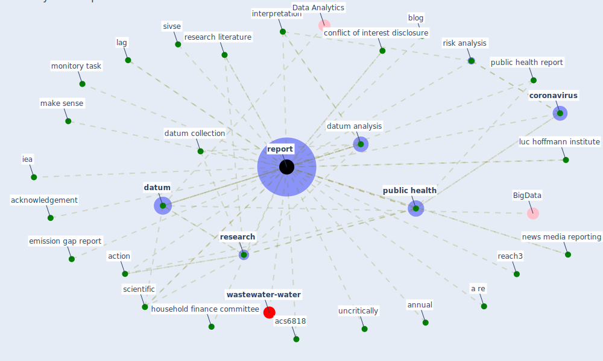

# Keyword: report

* [wastewater-water](cluster_0)

## Keywords

 * Cluster_0, a re, a res 60 1, acknowledgement, acs6818, action, [analysis](keyword_analysis), annual, as be, b77, bankruptcy law reform committee, [bim](keyword_bim), blog, comprehensive assessment, conflict of interest disclosure, [coronavirus](keyword_coronavirus), [covid-19](keyword_covid-19), crd, data analyse, [datum](keyword_datum), datum analysis, datum collection, document, emission gap report, ephb, full paper, gender base violence, gender base violence in develop country, household finance committee, [iea](keyword_iea), [information](keyword_information), information already available, interference, interim report, interpretation, lag, luc hoffmann institute, make sense, measure for the economic development of under develop country, measure for the economic development of under developedcountrie, meeting report, monitory, monitory task, more elaborate reporting, news media reporting, noyb, npls, predictive maintenance, preventive medicine, [public health](keyword_public_health), public health report, reach3, reach3 report, recentlyrecorded, [report](keyword_report), reported, reporting, reports, [research](keyword_research), research literature, research report, risk analysis, same month the year before, scientific, sivse, song, technical, uncritically, under report, underreporte, world commission on environment and development

## Mapping

## Neighbours

### Closest articles

* World Bank Development Report - [LINK](article_world_bank_world_2022)
* Validity of energy social research during and after COVID-19: challenges, considerations, and responses - [LINK](article_fell_validity_2020)
* Respiratory pandemics, urban planning and design: A multidisciplinary rapid review of the literature - [LINK](article_harris_respiratory_2022)
* Impact of COVID-19 on IoT Adoption in Healthcare, Smart Homes, Smart Buildings, Smart Cities, Transportation and Industrial IoT - [LINK](article_umair_impact_2021)
* Health, Wellbeing \& Productivity in Offices - [LINK](article_world_green_building_council_health_2014)
* Air, Surface Environmental, and Personal Protective Equipment Contamination by Severe Acute Respiratory Syndrome Coronavirus 2 (SARS-CoV-2) From a Symptomatic Patient - [LINK](article_ong_air_2020)
* How COVID-19 Could Accelerate the Adoption of New Retail Technologies and Enhance the (E-)Servicescape - [LINK](article_willems_how_2021)
* Urban planning after COVID-19 - [LINK](article_rtpi_urban_2021)
* The socio-economic determinants of COVID-19: A spatial analysis of German county level data - [LINK](article_ehlert_socio-economic_2021)
* Assessment of COVID-19 precautionary measures in sports facilities: A case study on a health club in Saudi Arabia - [LINK](article_ibrahim_assessment_2022)

### Closest BPs

