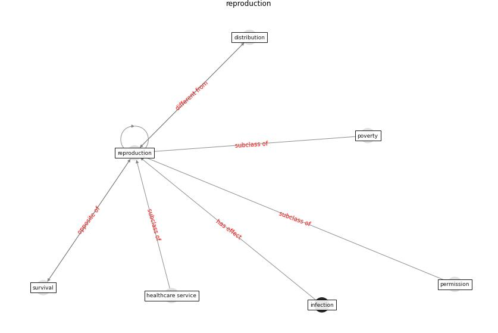

# Keyword: __reproduction__
## Clusters

* Cluster 6: [building-guidance](cluster_6)

## Concepts

 

## Articles
* Assessing the health and hygiene performance of apartment
buildings ([ho_assessing_2004](article_ho_assessing_2004))
* Analysis of COVID-19 Concerns Raised by the
Construction Workforce and Development of
Mitigation Practices ([bou_hatoum_analysis_2021](article_bou_hatoum_analysis_2021))
* A Global Survey of Infection Control and
Mitigation Measures for Combating the Transmission
of COVID-19 Pandemic in Buildings Under
Facilities Management Services ([sarvari_global_2022](article_sarvari_global_2022))
* A Global Survey of Infection Control and
Mitigation Measures for Combating the Transmission
of COVID-19 Pandemic in Buildings Under
Facilities Management Services ([sarvari_global_2022](article_sarvari_global_2022))
* COVID-19 Higher Mortality in Chinese Regions
With Chronic Exposure to Lower Air Quality ([pansini_covid-19_2021](article_pansini_covid-19_2021))
* nassereddine_propositions_2021 ([nassereddine_propositions_2021](article_nassereddine_propositions_2021))
* carvalhaes_covid-19_2020 ([carvalhaes_covid-19_2020](article_carvalhaes_covid-19_2020))
* afrin_covid-19_2021 ([afrin_covid-19_2021](article_afrin_covid-19_2021))
* Effects of temperature and humidity on the spread of
COVID-19: A systematic review ([mecenas_effects_2020](article_mecenas_effects_2020))
* Coronavirus disease 2019: The harms of exaggerated
information and non‐evidence‐based measures ([ioannidis_coronavirus_2020](article_ioannidis_coronavirus_2020))
