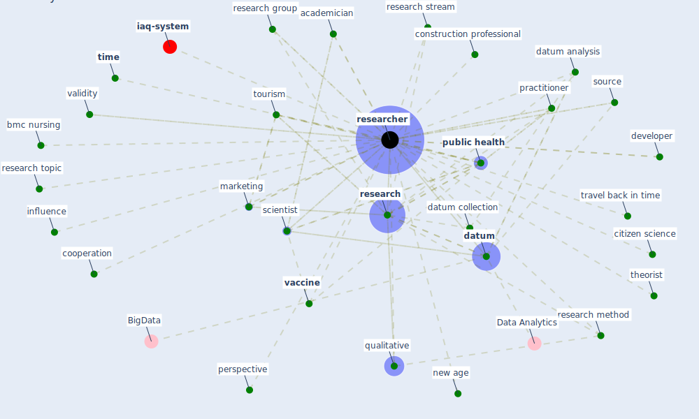

# Keyword: researcher

* [iaq-system](cluster_3)

## Keywords

 * Cluster_3, academician, bmc nursing, citizen science, collaboration, confound, [construction professional](keyword_construction_professional), cooperation, [datum](keyword_datum), datum analysis, datum collection, developer, doctor, doctor training, [drone](keyword_drone), dynamic dashboard, iap, in depth interview, interview method, influence, [marketing](keyword_marketing), [model](keyword_model), new age, [perspective](keyword_perspective), policy maker, practitioner, [public health](keyword_public_health), [qualitative](keyword_qualitative), quantitative research, quantitative research method, [research](keyword_research), research group, research method, research stream, research topic, [researcher](keyword_researcher), researchers, [resilience](keyword_resilience), scientist, source, theorist, [time](keyword_time), [tourism](keyword_tourism), travel back in time, [vaccine](keyword_vaccine), validity

## Mapping

## Neighbours

### Closest articles

* Validity of energy social research during and after COVID-19: challenges, considerations, and responses - [LINK](article_fell_validity_2020)
* Supporting Technologies for COVID-19 Prevention: Systemized Review - [LINK](article_zhao_supporting_2022)
* A comprehensive review on indoor air quality monitoring systems for enhanced public health - [LINK](article_saini_comprehensive_2020)
* The City Under COVID‐19: Podcasting As Digital Methodology - [LINK](article_rogers_city_2020)
* COVID-19 and Green Housing: A Review of Relevant Literature - [LINK](article_kaklauskas_covid-19_2021)
* Guidelines for Responding to COVID-19 Pandemic: Best Practices, Impacts, and Future Research Directions - [LINK](article_assaad_guidelines_2021)
* Occupant health in buildings: Impact of the COVID-19 pandemic on the opinions of building professionals and implications on research - [LINK](article_awada_occupant_2022)
* Internet of things (IoT) applications to fight against COVID-19 pandemic - [LINK](article_singh_internet_2020)
* The Effects of Pandemic on Construction Industry in the UK - [LINK](article_shibani_effects_2020)
* A review of definitions and measures of system resilience - [LINK](article_hosseini_review_2016)

### Closest BPs

