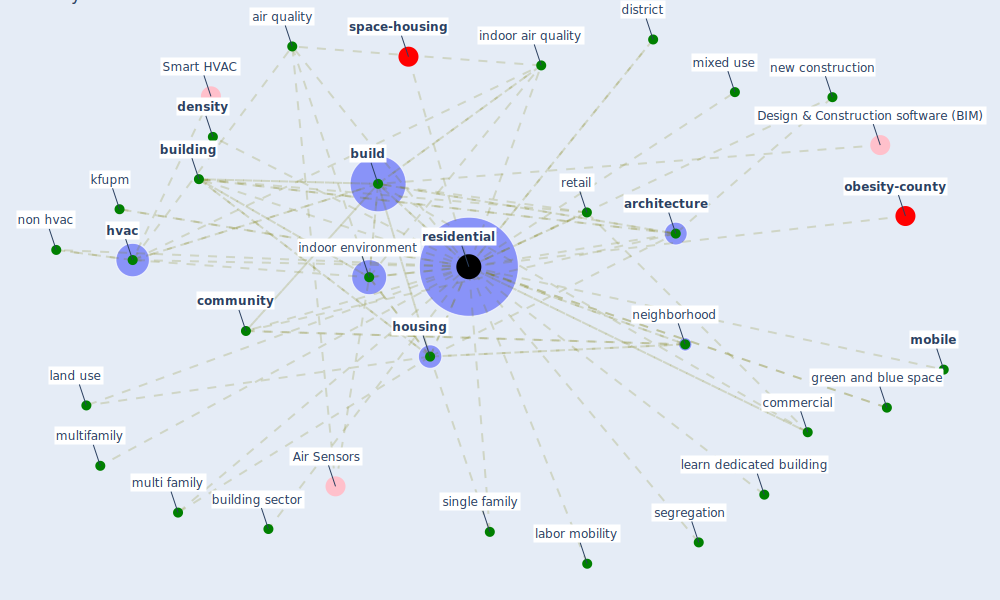

# Keyword: residential

* [housing-space](cluster_14)

## Keywords

 * Cluster_14, air quality, [apartment](keyword_apartment), [architecture](keyword_architecture), [build](keyword_build), [building](keyword_building), building design, building sector, building type, built density, burglar, collective housing, commercial, [community](keyword_community), complex, [construction](keyword_construction), construction concept, construction density, consumption, [covid 19 pandemic](keyword_covid_19_pandemic), [covid-19](keyword_covid-19), [density](keyword_density), [design](keyword_design), district, educational, energy use, [environment](keyword_environment), green and blue space, heating, high rise, [home](keyword_home), [house](keyword_house), [housing](keyword_housing), [hvac](keyword_hvac), [indoor air quality](keyword_indoor_air_quality), [indoor environment](keyword_indoor_environment), [kfupm](keyword_kfupm), labor mobility, land use, learn dedicated building, mixed use, mobile, multi family, multifamily, [neighborhood](keyword_neighborhood), new construction, non hvac, nonresidential, pilot addenda well, rehabilitation center, [residential](keyword_residential), retail, segregation, single family, suburban architecture, townhome, urban community

## Mapping

## Neighbours

### Closest articles

* Readiness Assessment of Green Building Certification Systems for Residential Buildings during Pandemics - [LINK](article_tleuken_readiness_2021)
* Towards Resilient Residential Buildings and Neighborhoods in Light of COVID-19 Pandemic—The Scenario of Podgorica, Montenegro - [LINK](article_bojovic_towards_2022)
* Impacts of COVID-19 on residential building energy use and performance - [LINK](article_kawka_impacts_2021)
* COVID-19 and Green Housing: A Review of Relevant Literature - [LINK](article_kaklauskas_covid-19_2021)
* Treating two pandemics for the price of one: Chronic and infectious disease impacts of the built and natural environment - [LINK](article_frank_treating_2021)
* Housing Experience in Gated Communities in the Time of Pandemics: Lessons Learned from COVID-19 - [LINK](article_asfour_housing_2022)
* Ten questions concerning occupant health in buildings during normal operations and extreme events including the COVID-19 pandemic - [LINK](article_awada_ten_2021)
* Occupant health in buildings: Impact of the COVID-19 pandemic on the opinions of building professionals and implications on research - [LINK](article_awada_occupant_2022)
* RESIDENTIAL ARCHITECTURE IN A POST-PANDEMIC WORLD: IMPLICATIONS OF COVID-19 FOR NEW CONSTRUCTION AND FOR ADAPTING HERITAGE BUILDINGS - [LINK](article_spennemann_residential_2021)
* Assessment method for new sustainability indicators providing pandemic resilience for residential buildings - [LINK](article_tokazhanov_assessment_2021)

### Closest BPs

