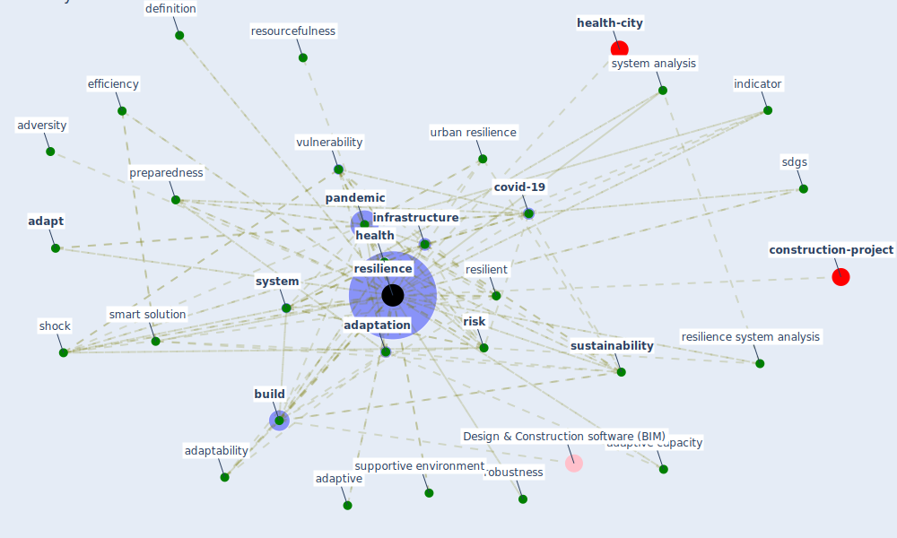

# Keyword: resilience

* [resilience-infrastructure](cluster_11)

## Keywords

 * ability, absorptive, absorptive capacity, adapt, adaptability, adaptation, adaptive, adaptive capacity, adversity, [asset](keyword_asset), behavior, [build](keyword_build), [build environment](keyword_build_environment), business continuity, cascade failure, [climate change](keyword_climate_change), [community](keyword_community), [construction](keyword_construction), [covid 19 pandemic](keyword_covid_19_pandemic), [covid-19](keyword_covid-19), [crisis](keyword_crisis), crisis management, [datum protection](keyword_datum_protection), define, definition, definition of resilience, disaster, disaster preparedness, disruptive event, diversification, [economic](keyword_economic), [ecosystem](keyword_ecosystem), [efficiency](keyword_efficiency), efficiency, ej, [engineering](keyword_engineering), enterprise information system, [entrepreneur](keyword_entrepreneur), [entrepreneurship](keyword_entrepreneurship), equity, factor, fight spirit, [health](keyword_health), health field, health policy, [indicator](keyword_indicator), [infrastructure](keyword_infrastructure), [interdependency](keyword_interdependency), jemax, [measure](keyword_measure), measure of a system, metric, [mitigation](keyword_mitigation), organization, [pandemic](keyword_pandemic), [plan](keyword_plan), practichome, preparedness, quality of service, quantitative analysis, readiness, [recovery](keyword_recovery), redundancy, reliability, [resilience](keyword_resilience), resilience assessment, resilience boost, resilience engineering, [resilience system analysis](keyword_resilience_system_analysis), resilience triangle, [resilient](keyword_resilient), resourcefulness, reverse stress test, [risk](keyword_risk), risk management, robustness, [sdgs](keyword_sdgs), sheffi, [shock](keyword_shock), smart solution, smart solution and technology, smart technology, smartness, supply shock, supportive environment, survivability, [sustainability](keyword_sustainability), sustainable, [sustainable development](keyword_sustainable_development), [system](keyword_system), [system analysis](keyword_system_analysis), system level, system level resilience, system shock, [technology](keyword_technology), urban resilience, [vulnerability](keyword_vulnerability), vulnerability reduction, [well be](keyword_well_be), flexibility

## Mapping

## Neighbours

### Closest articles

* A review of definitions and measures of system resilience - [LINK](article_hosseini_review_2016)
* Strengthening resilience: a priority shared by Health 2020 and - [LINK](article_who_strengthening_2017)
* Guidelines for resilience systems analysis - [LINK](article_oecd_guidelines_2014)
* Contributions of Smart City Solutions and Technologies to Resilience against the COVID-19 Pandemic: A Literature Review - [LINK](article_sharifi_contributions_2021)
* COVID-19 and a new resilient infrastructure landscape - [LINK](article_oecd_covid-19_2021)
* Propositions for a Resilient, Post-COVID-19 Future for the AEC Industry - [LINK](article_nassereddine_propositions_2021)
* Towards Resilient Residential Buildings and Neighborhoods in Light of COVID-19 Pandemic—The Scenario of Podgorica, Montenegro - [LINK](article_bojovic_towards_2022)
* COVID-19 as a Harbinger of Transforming Infrastructure Resilience - [LINK](article_carvalhaes_covid-19_2020)
* Learning from pandemics: Applying resilience thinking to identify priorities for planning urban settlements - [LINK](article_syal_learning_2021)
* Startups in times of crisis – A rapid response to the COVID-19 pandemic - [LINK](article_kuckertz_startups_2020)

### Closest BPs

