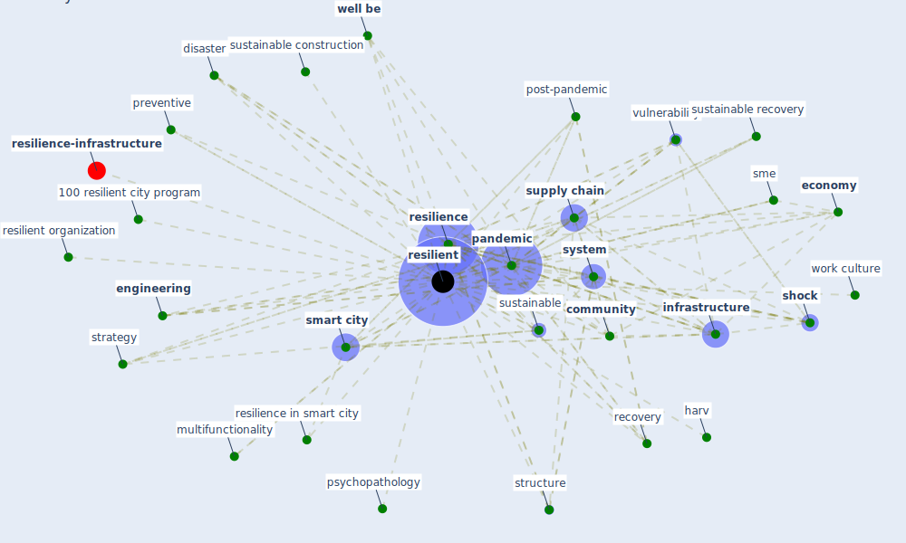

# Keyword: resilient

* [resilience-infrastructure](cluster_11)

## Keywords

 * 100 resilient city program, Cluster_11, agile, agile engineering, biophilic city, [build](keyword_build), building typologie, [business](keyword_business), [city](keyword_city), climate change adaptation, [community](keyword_community), connect, [construction](keyword_construction), construction system, disaster, [economy](keyword_economy), education system, [engineering](keyword_engineering), futuristic, harv, [infrastructure](keyword_infrastructure), innovative, innovative business, israel, multifunctionality, organization, [pandemic](keyword_pandemic), post-pandemic, preventive, [psychopathology](keyword_psychopathology), [recovery](keyword_recovery), [resilience](keyword_resilience), resilience in smart city, [resilient](keyword_resilient), resilient organization, [shock](keyword_shock), [smart city](keyword_smart_city), [sme](keyword_sme), strategy, structure, [supply chain](keyword_supply_chain), sustainable, sustainable construction, sustainable recovery, [system](keyword_system), [vulnerability](keyword_vulnerability), [well be](keyword_well_be), work culture, workforce in china

## Mapping

## Neighbours

### Closest articles

* Prophylactic Architecture: Formulating the Concept of Pandemic-Resilient Homes - [LINK](article_elrayies_prophylactic_2022)
* How is COVID-19 Experience Transforming Sustainability Requirements of Residential Buildings? A Review - [LINK](article_tokazhanov_how_2020)
* How COVID-19 Could Accelerate the Adoption of New Retail Technologies and Enhance the (E-)Servicescape - [LINK](article_willems_how_2021)
* Propositions for a Resilient, Post-COVID-19 Future for the AEC Industry - [LINK](article_nassereddine_propositions_2021)
* Strategies to Mitigate COVID-19 Pandemic Impacts on Health and Safety of Workers in Construction Projects - [LINK](article_kaushal_strategies_2021)
* Preparing critical infrastructure for the future: Lessons learnt from the Covid-19 pandemic - [LINK](article_tomalska_preparing_2022)
* Urban planning after COVID-19 - [LINK](article_rtpi_urban_2021)
* Guidelines for resilience systems analysis - [LINK](article_oecd_guidelines_2014)
* Green in times of COVID-19: urban green space relevance during the COVID-19 pandemic in Buenos Aires City - [LINK](article_marconi_green_2022)
* Readiness Assessment of Green Building Certification Systems for Residential Buildings during Pandemics - [LINK](article_tleuken_readiness_2021)

### Closest BPs

