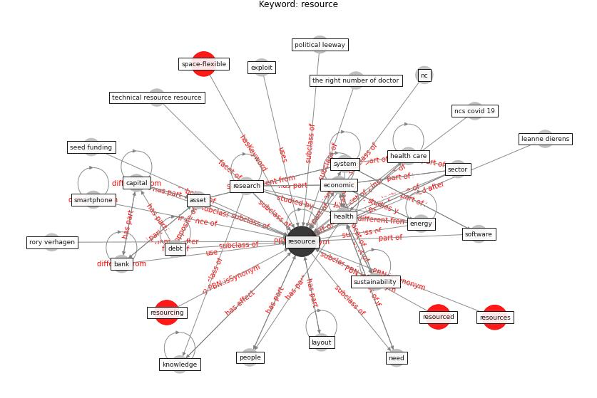

# Keyword: resource

* [space-flexible](cluster_Cluster_14)

## Keywords

 * Cluster_14, [asset](keyword_asset), [bank](keyword_bank), [capability](keyword_capability), capital, consumption, crisis response, debt, [economic](keyword_economic), ecosystem, [energy](keyword_energy), exploit, [health](keyword_health), [health care](keyword_health_care), healthcare worker, human capital, human resource, jake w obrien, jiaying li, [knowledge](keyword_knowledge), labor, layout, leanne dierens, librisso de, limitation of resource, nc, ncs covid 19, need, [people](keyword_people), political leeway, [public housing](keyword_public_housing), [research](keyword_research), research and development, research topic, [resource](keyword_resource), resource leanne dierens, resource paper, resource planning, resourced, resources, resourcing, rory verhagen, sector, seed funding, smartphone, software, [sustainability](keyword_sustainability), [system](keyword_system), technical resource, technical resource resource, the right number of doctor, timescale, [water](keyword_water), water 4 0, wendy j m smith

## Concepts

 

## Neighbours

### Closest articles

* Digital Twin of COVID-19 Mass Vaccination Centers - [LINK](article_pilati_digital_2021)
* First confirmed detection of SARS-CoV-2 in untreated wastewater in Australia: A proof of concept for the wastewater surveillance of COVID-19 in the community - [LINK](article_ahmed_first_2020)
* COVID-19 Could Leverage a Sustainable Built Environment - [LINK](article_pinheiro_covid-19_2020)
* How COVID-19 Could Accelerate the Adoption of New Retail Technologies and Enhance the (E-)Servicescape - [LINK](article_willems_how_2021)
* World Bank Development Report - [LINK](article_world_bank_world_2022)
* COVID-19 and a new resilient infrastructure landscape - [LINK](article_oecd_covid-19_2021)
* COVID-19 pandemic: the effects and prospects in the construction industry. - [LINK](article_ogunnusi_covid-19_2020)
* Emerging Technologies to Combat the COVID-19 Pandemic - [LINK](article_vaishya_emerging_2020)
* Strengthening resilience: a priority shared by Health 2020 and - [LINK](article_who_strengthening_2017)
* Analysis of COVID-19 Concerns Raised by the Construction Workforce and Development of Mitigation Practices - [LINK](article_bou_hatoum_analysis_2021)

### Closest BPs

