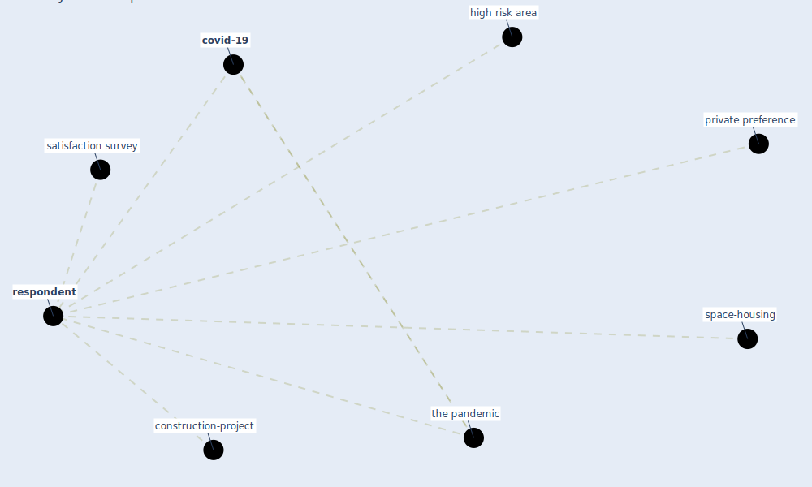

# Keyword: respondent

* [space-housing](cluster_4)

* [construction-project](cluster_8)

## Keywords

 * Cluster_4, Cluster_8, [covid-19](keyword_covid-19), high risk area, private preference, [respondent](keyword_respondent), respondents, satisfaction survey, the pandemic

## Mapping

## Neighbours

### Closest articles

* Urban Community Sustainable Development Patterns under the Influence of COVID-19: A Case Study Based on the Non-Contact Interaction Perspective of Hangzhou City - [LINK](article_wang_urban_2021)
* The impacts of knowledge, risk perception, emotion and information on citizens’ protective behaviors during the outbreak of COVID-19: a cross-sectional study in China - [LINK](article_ning_impacts_2020)
* The impact of the COVID-19 pandemic on the importance of urban green spaces to the public - [LINK](article_noszczyk_impact_2022)
* Effects to Construction Project Management Impacted Circular Economic of Covid-19 Pandemic - [LINK](article_paikan_effects_2021)

### Closest BPs

