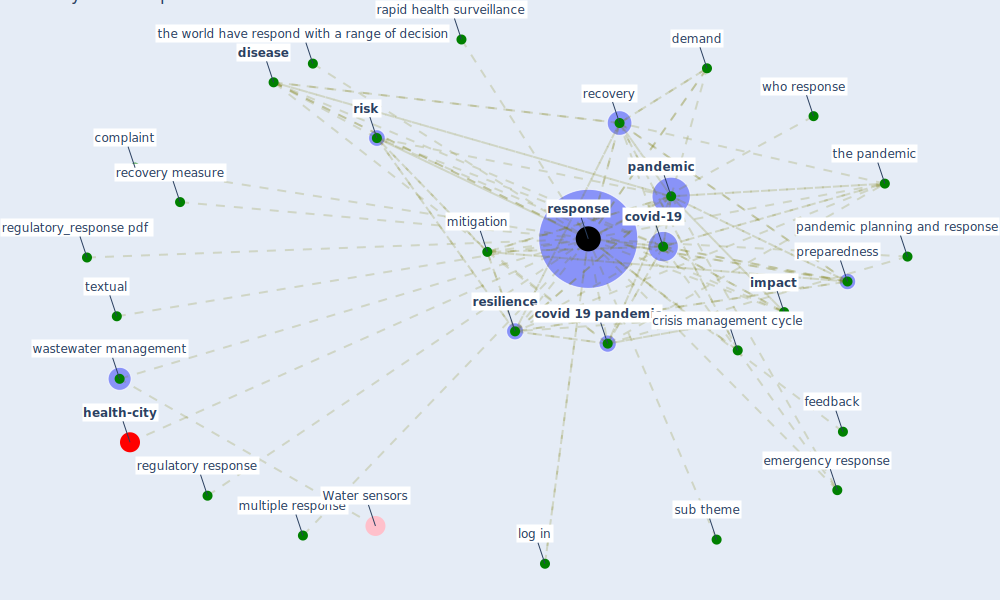

# Keyword: response

* [health-city](cluster_1)

## Keywords

 * Cluster_1, administrative burden, [climate change](keyword_climate_change), codify, complaint, cope, [covid 19 crisis](keyword_covid_19_crisis), [covid 19 pandemic](keyword_covid_19_pandemic), [covid-19](keyword_covid-19), crisis management cycle, demand, [disease](keyword_disease), disturbance, emergency response, [europe](keyword_europe), evidence base, feedback, frequency, [impact](keyword_impact), integratedpreparedness, landscape, log in, [mitigation](keyword_mitigation), multiple response, n, [pandemic](keyword_pandemic), pandemic condition, pandemic planning and response, pandemic preparedness, pandemic preparedness and response, pd, [plan](keyword_plan), preparedness, protect the most vulnerable, [quarantine](keyword_quarantine), rapid health surveillance, raw, [recovery](keyword_recovery), recovery measure, regulatory response, regulatory_response pdf, [resilience](keyword_resilience), [response](keyword_response), responses, [risk](keyword_risk), sub theme, [survey](keyword_survey), textual, the pandemic, the world have respond with a range of decision, wastewater management, who response, who response or lack of, [world health organization](keyword_world_health_organization)

## Mapping

## Neighbours

### Closest articles

* The COVID-19 pandemic: Impacts on cities and major lessons for urban planning, design, and management - [LINK](article_sharifi_covid-19_2020)
* World Bank Development Report - [LINK](article_world_bank_world_2022)
* Preparing critical infrastructure for the future: Lessons learnt from the Covid-19 pandemic - [LINK](article_tomalska_preparing_2022)
* Respiratory pandemics, urban planning and design: A multidisciplinary rapid review of the literature - [LINK](article_harris_respiratory_2022)
* Response to COVID-19 in Taiwan - [LINK](article_wang_response_2020)
* How COVID-19 Could Accelerate the Adoption of New Retail Technologies and Enhance the (E-)Servicescape - [LINK](article_willems_how_2021)
* Urban planning after COVID-19 - [LINK](article_rtpi_urban_2021)
* Readiness Assessment of Green Building Certification Systems for Residential Buildings during Pandemics - [LINK](article_tleuken_readiness_2021)
* Amplifying the role of knowledge translation platforms in the COVID-19 pandemic response - [LINK](article_el-jardali_amplifying_2020)
* COVID-19 Pandemic: Rethinking Strategies for Resilient Urban Design, Perceptions, and Planning - [LINK](article_afrin_covid-19_2021)

### Closest BPs

